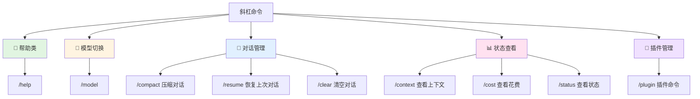

# 03-快捷手势：常用的斜杠命令

## 本章目标

学完这一章,你将掌握:

- 理解斜杠命令的作用(就像手机快捷手势一样方便)
- 会用 6 个最常用的命令
- 知道如何查命令手册
- 能自己探索更多命令

**学习时长**: 15 分钟
**动手实践**: 5 个小任务

---

## 一个生活化的类比:手机快捷手势

还记得第一次用 iPhone 的时候吗?

- **双击截屏** → 不用按两个物理按键了
- **三指滑动** → 快速撤销刚才的误操作
- **双击空格** → 自动打句号
- **长按空格** → 移动光标

这些"快捷手势"让你操作更高效,不用绕路去设置菜单找功能。

**Claude Code 的斜杠命令就是这个角色**:

```
普通方式: "能不能帮我看看现在对话用了多少 token?"
斜杠方式: /cost
```

一个字符搞定!

---

## 命令全景图:按用途分类



---

## 重点命令详解

### 1. /help - 你的随身说明书

**场景**: 忘记命令怎么用了?

```bash
# 查看所有命令
/help

# 查看具体命令用法
/help model
/help plugin
```

**输出示例**:

```
Available commands:
  /help [command]     - Show help for a command
  /model [name]       - Switch AI model
  /compact            - Compress conversation history
  /resume             - Resume previous conversation
  ...
```

**类比**: 手机的"设置 → 帮助中心"

**使用频率**: ⭐⭐⭐ (新手必备,用熟后就不常用了)

---

### 2. /model - 模型切换器

**场景**:
- 简单任务用 Haiku (便宜快速)
- 复杂任务用 Sonnet (聪明全能)
- 超级难题用 Opus (最强大脑)

```bash
# 查看可用模型
/model

# 切换到 Haiku (省钱模式)
/model haiku

# 切换到 Opus 4.5 (旗舰模式)
/model opus
```

**三个模型怎么选?**

| 模型 | 适用场景 | 类比 |
|------|---------|------|
| **Haiku 3.5** | 简单文本处理、快速问答 | 🚲 自行车 - 快捷代步 |
| **Sonnet 4.5** | 写代码、分析文档、日常开发 | 🚗 家用轿车 - 日常通勤 |
| **Opus 4.5** | 复杂架构设计、疑难杂症 | 🚁 直升机 - 特殊任务 |

**类比**: 手机的"性能模式" vs "省电模式"

**使用频率**: ⭐⭐⭐⭐ (根据任务灵活切换)

---

### 3. /compact - 对话压缩器

**场景**: 聊了 50 轮,感觉 AI 回复变慢了?

```bash
/compact
```

**发生了什么?**

- AI 会把前面的对话"浓缩"成摘要
- 保留关键信息,删除冗余细节
- 释放上下文空间,提升响应速度

**类比**: 手机的"清理缓存"

```
压缩前 (100 轮对话):
├─ 1-20 轮: 讨论需求
├─ 21-50 轮: 写代码
├─ 51-80 轮: 改 Bug
└─ 81-100 轮: 优化

压缩后 (精简版):
├─ 摘要: 实现了用户登录功能
├─ 关键代码: login.ts 已完成
└─ 待办事项: 测试边界情况
```

**使用频率**: ⭐⭐⭐ (长对话必用)

---

### 4. /resume - 时光倒流

**场景**: 关闭终端后,想继续昨天的工作?

```bash
# 恢复上一次对话
/resume

# 恢复并查看之前的内容
/resume --show-history
```

**类比**: 浏览器的"恢复上次会话"

**注意事项**:
- 只能恢复最近一次对话
- 如果中间开了新对话,旧对话就找不回来了
- 建议重要工作用 Git 记录,不要只靠恢复功能

**使用频率**: ⭐⭐⭐ (每天开工必用)

---

### 5. /context - 上下文探测器

**场景**: 想知道 AI 现在"看到"了什么信息?

```bash
/context
```

**输出示例**:

```
Current Context:
- Files in context: 3
  - /src/login.ts (234 lines)
  - /src/utils.ts (89 lines)
  - /config/env.ts (12 lines)

- Conversation turns: 15
- Token usage: 12,450 / 200,000
- Model: claude-sonnet-4.5
```

**类比**: 手机的"存储空间管理"

**什么时候用?**

- 对话很长,不确定 AI 是否记得前面的内容
- 准备加载新文件,想看看会不会超出限制
- Debug 时确认 AI 是否看到了关键文件

**使用频率**: ⭐⭐ (偶尔检查)

---

### 6. /cost - 账单查询

**场景**: 担心用太多 Token,想看看花了多少钱?

```bash
/cost
```

**输出示例**:

```
Cost Summary:
━━━━━━━━━━━━━━━━━━━━━━━━━━━━━━━━━━━━━
This Conversation:
  Input tokens:   12,340  ($0.037)
  Output tokens:   3,120  ($0.047)
  Total:          15,460  ($0.084)

Today's Usage:
  Total tokens:   45,890  ($0.276)

Model: claude-sonnet-4.5
```

**类比**: 手机的"流量使用情况"

**省钱小技巧**:

1. 简单任务用 `/model haiku`
2. 定期 `/compact` 压缩对话
3. 避免重复加载大文件

**使用频率**: ⭐⭐⭐ (每天看一眼)

---

## 动手实践:试试这些命令

### 任务 1: 查看命令手册

```bash
# 在 Claude Code 终端输入
/help
```

**观察**: 看看有哪些命令是你感兴趣的?

---

### 任务 2: 切换模型体验

```bash
# 切换到 Haiku
/model haiku

# 问个简单问题
"帮我解释一下 JavaScript 的闭包"

# 切换回 Sonnet
/model sonnet

# 再问一次同样的问题
"帮我解释一下 JavaScript 的闭包"
```

**对比**: Haiku 和 Sonnet 的回答有什么区别?

---

### 任务 3: 查看上下文

```bash
# 先打开几个文件 (如果你有项目的话)
"帮我读取 package.json 和 README.md"

# 查看上下文
/context
```

**观察**: 能看到哪些信息?Token 用了多少?

---

### 任务 4: 压缩对话

```bash
# 先聊几轮 (至少 10 轮)
"帮我写一个 TODO 应用"
... (继续对话)

# 压缩对话
/compact

# 再查看上下文
/context
```

**对比**: 压缩前后 Token 数量有什么变化?

---

### 任务 5: 查看花费

```bash
/cost
```

**计算**: 如果每天用这么多 Token,一个月大概花多少钱?

---

## 命令速查表(打印版)

### 新手必学 (6 个)

| 命令 | 作用 | 场景 | 频率 |
|------|------|------|------|
| `/help` | 查看命令帮助 | 忘记用法时 | ⭐⭐⭐ |
| `/model` | 切换 AI 模型 | 根据任务选模型 | ⭐⭐⭐⭐ |
| `/compact` | 压缩对话历史 | 对话太长变慢 | ⭐⭐⭐ |
| `/resume` | 恢复上次对话 | 重启终端后 | ⭐⭐⭐ |
| `/context` | 查看上下文信息 | 确认 AI 看到了什么 | ⭐⭐ |
| `/cost` | 查看 Token 花费 | 查账单 | ⭐⭐⭐ |

### 进阶命令 (了解即可)

| 命令 | 作用 | 场景 |
|------|------|------|
| `/clear` | 清空当前对话 | 重新开始新任务 |
| `/status` | 查看系统状态 | 检查网络连接 |
| `/plugin` | 管理插件 | 安装/更新插件 |
| `/agent` | 调用子代理 | 复杂任务分解 |

---

## 本章小结

### 你学到了什么?

✅ **核心概念**:
- 斜杠命令是快捷操作,像手机快捷手势
- 不同命令解决不同问题

✅ **必会 6 命令**:
- `/help` - 查手册
- `/model` - 换模型
- `/compact` - 压缩对话
- `/resume` - 恢复会话
- `/context` - 看上下文
- `/cost` - 查花费

✅ **实用技巧**:
- 简单任务用 Haiku 省钱
- 长对话记得 compact
- 每天看一眼 cost 控制预算

---

### 下一章预告

**第 4 章: 文件操作 - 让 AI 看你的代码**

你将学会:
- 如何让 AI 读取文件
- 如何让 AI 修改代码
- 如何一次操作多个文件
- 如何避免 AI"看"太多文件导致超限

---

### 作业 (可选)

1. **练习所有 6 个命令**,每个至少用一次
2. **切换模型对比**: 用 Haiku 和 Sonnet 问同一个问题,看回答质量
3. **记录一天的花费**: 用 `/cost` 记录今天用了多少 Token
4. **探索更多命令**: 用 `/help` 看看还有哪些命令,试试看

---

### 常见问题

**Q: 斜杠命令可以撤销吗?**
A: 大部分不能撤销 (比如 `/clear`),但 `/compact` 之后还能看到历史摘要。建议重要工作用 Git 保存,不要只靠对话历史。

**Q: `/resume` 恢复不了怎么办?**
A: 可能是中间开了新对话。建议每次关闭前用 Git 提交代码,不要完全依赖恢复功能。

**Q: Haiku 和 Sonnet 价格差多少?**
A: Haiku 便宜约 10 倍,但能力也弱一些。简单任务 (写注释、改格式) 用 Haiku,复杂任务 (架构设计、Debug) 用 Sonnet。

**Q: 命令可以组合使用吗?**
A: 不行,一次只能输入一个命令。但你可以连续输入多个命令。

**Q: 有快捷键吗?**
A: 没有,必须手动输入斜杠命令。但命令很短,输入很快。

---

**下一章见!** 🎉
