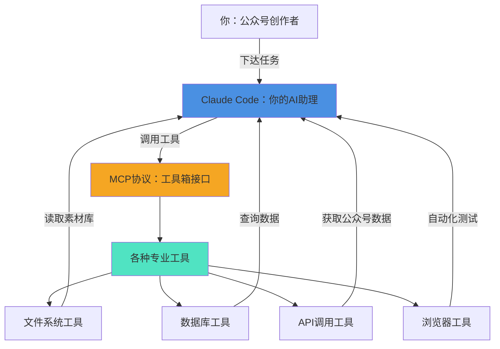
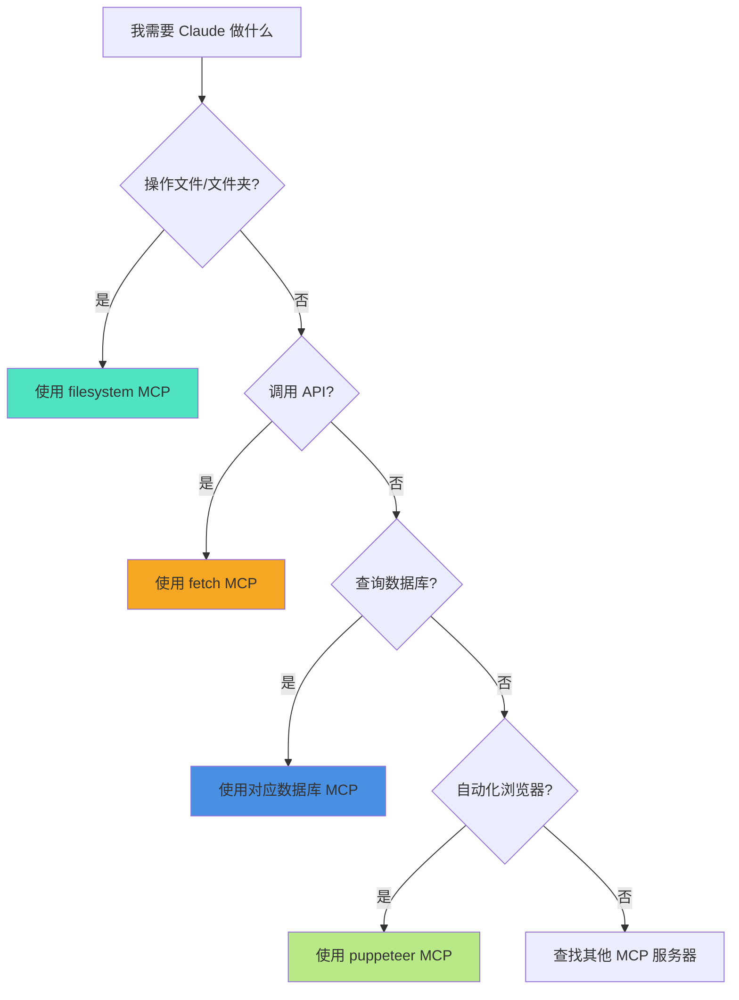

# 07 - 连接外部工具：MCP 服务器

## 本章目标

学完本章，你将能够：

- 理解什么是 MCP（Model Context Protocol）
- 知道为什么 Claude Code 需要 MCP
- 使用 `/mcp` 命令查看已连接的工具
- 了解常见的 MCP 服务器类型

## 类比：给助理配备专业工具箱

想象一下，你雇了一个助理帮你整理素材库。

### 场景 1：普通助理（没有工具箱）

助理能做的事：
- 听你口述素材内容，记在脑子里
- 根据记忆帮你分析和整理
- 但无法直接打开你的文件夹查看原始文件

**限制**：你得把所有素材内容一个个复制粘贴给助理，非常麻烦。

### 场景 2：专业助理（有工具箱）

助理能做的事：
- 直接访问你的素材库文件夹
- 自己搜索、打开、读取文件
- 自动统计素材数量和分类
- 甚至可以连接你的微信公众号后台，自动获取阅读数据

**优势**：你只需要告诉助理目标，助理自己去找工具完成任务。

这就是 **MCP** 的作用：**给 Claude 配备各种专业工具，让它能独立完成更复杂的任务**。

## MCP 全景图



**核心理解**：
- Claude Code = 你的 AI 助理
- MCP = 工具箱接口标准
- MCP 服务器 = 具体的工具（文件系统、数据库、API 等）

## 为什么需要 MCP

| 对比维度 | 没有 MCP | 有 MCP |
|---------|---------|-------|
| **文件操作** | 你得手动复制粘贴文件内容 | Claude 自己读取文件夹 |
| **数据查询** | 你得导出数据再发给 Claude | Claude 直接连接数据库查询 |
| **API 调用** | 你得手动复制 API 响应结果 | Claude 自己调用 API |
| **工作效率** | 大量重复劳动 | 自动化处理 |
| **准确性** | 容易复制错误或遗漏 | 直接访问源数据 |

### 真实场景举例

#### 场景 1：整理素材库

**没有 MCP**：
1. 你打开素材文件夹
2. 一个个复制文件内容
3. 粘贴给 Claude
4. Claude 分析
5. 重复 50 次（如果有 50 个素材）

**有 MCP**：
1. 你告诉 Claude："帮我整理 `/素材库/2024年12月/` 文件夹的所有内容"
2. Claude 自动读取所有文件
3. 自动分析分类
4. 生成整理报告

#### 场景 2：分析公众号数据

**没有 MCP**：
1. 你登录公众号后台
2. 手动导出阅读数据
3. 复制粘贴给 Claude
4. 每次想更新数据都得重复

**有 MCP**：
1. 你配置好公众号 API 工具
2. 告诉 Claude："分析这个月的阅读趋势"
3. Claude 自己调用 API 获取最新数据
4. 实时生成分析报告

## 查看已连接的工具箱

Claude Code 提供了 `/mcp` 命令，让你查看当前连接了哪些工具。

### 基础用法

```bash
/mcp
```

**返回示例**：

```
已连接的 MCP 服务器：

1. filesystem
   - 描述：访问本地文件系统
   - 状态：已连接
   - 工具数：5 个（读取文件、写入文件、列出目录等）

2. sqlite
   - 描述：查询 SQLite 数据库
   - 状态：已连接
   - 工具数：3 个（执行查询、查看表结构等）

3. fetch
   - 描述：发送 HTTP 请求
   - 状态：已连接
   - 工具数：2 个（GET 请求、POST 请求）
```

### 理解输出

| 字段 | 含义 |
|-----|------|
| **名称** | MCP 服务器的名称（如 filesystem） |
| **描述** | 这个工具箱是干什么的 |
| **状态** | 是否正常连接 |
| **工具数** | 这个工具箱包含多少个具体工具 |

## 常见 MCP 服务器举例

### 内置常用工具

| MCP 服务器 | 用途 | 典型场景 |
|-----------|------|---------|
| **filesystem** | 访问本地文件系统 | 读取素材库、整理文件、批量重命名 |
| **fetch** | 发送 HTTP 请求 | 调用公众号 API、查询数据接口 |
| **sqlite** | 查询 SQLite 数据库 | 分析本地数据、统计信息 |

### 第三方扩展工具（需手动配置）

| MCP 服务器 | 用途 | 适用人群 |
|-----------|------|---------|
| **postgres** | 连接 PostgreSQL 数据库 | 需要查询云端数据库的用户 |
| **github** | 操作 GitHub 仓库 | 开发者、技术博主 |
| **puppeteer** | 自动化浏览器操作 | 需要爬取数据、自动化测试 |
| **google-drive** | 访问 Google Drive | 素材存储在 Google 云盘 |
| **slack** | 发送 Slack 消息 | 团队协作通知 |

### 如何选择工具

**决策树**：



## 实战演练：验证 filesystem 工具

### 步骤 1：查看已连接工具

```bash
/mcp
```

确认 `filesystem` 服务器已连接。

### 步骤 2：测试文件读取

假设你有一个素材文件夹：`/Users/你的用户名/公众号素材/2024年12月/`

对话示例：

**你说**：
> "帮我列出 `/Users/你的用户名/公众号素材/2024年12月/` 文件夹里的所有文件"

**Claude 的动作**：
1. 调用 `filesystem` MCP 的 `list_directory` 工具
2. 自动读取文件夹内容
3. 返回文件列表

**预期结果**：
```
找到以下文件：
1. 如何提升阅读量.md
2. 爆款标题技巧.md
3. 配图素材.png
4. 数据分析表.xlsx
```

### 步骤 3：深度分析

**你说**：
> "帮我分析这些素材的主题分布"

**Claude 的动作**：
1. 自动读取每个 `.md` 文件内容
2. 分析主题关键词
3. 生成分布报告

**你无需手动复制任何内容！**

## 进阶方向提示

学完 MCP 基础后，你可以继续探索：

### 方向 1：配置自定义 MCP 服务器

- 连接你的数据库
- 配置公众号 API 工具
- 接入团队协作工具（Slack、钉钉等）

**参考章节**：第 15 章《配置 MCP 服务器》

### 方向 2：组合使用多个工具

**案例**：自动化公众号数据分析流程
1. `fetch` MCP 调用公众号 API 获取数据
2. `sqlite` MCP 存储历史数据
3. `filesystem` MCP 生成分析报告文件

**参考章节**：第 16 章《自动化工作流》

### 方向 3：开发自己的 MCP 服务器

如果你有编程基础，可以学习如何开发自己的专用工具。

**参考资源**：[MCP 官方开发文档](https://modelcontextprotocol.io)

## 本章小结

### 核心概念

| 术语 | 通俗理解 |
|-----|---------|
| **MCP** | 工具箱接口标准（让 Claude 能用各种工具的协议） |
| **MCP 服务器** | 具体的工具（文件系统工具、数据库工具等） |
| **工具（Tool）** | 服务器提供的具体功能（读文件、写文件等） |

### 关键命令

```bash
/mcp              # 查看已连接的所有工具箱
```

### 思维转变

| 旧思维 | 新思维 |
|-------|-------|
| 我得手动给 Claude 提供所有数据 | 让 Claude 自己去获取数据 |
| 把 Claude 当成只能听话的工具 | 把 Claude 当成能独立工作的助理 |
| 重复性劳动浪费时间 | 配置好工具，一次解决 |

### 下一步

掌握了 MCP 的基础概念后，下一章我们将学习如何通过 **`.claude-code/config.yaml` 配置文件**来管理这些工具，让你的工作流更加自动化。

**继续阅读**：第 08 章《配置文件：管理你的 AI 助理》
