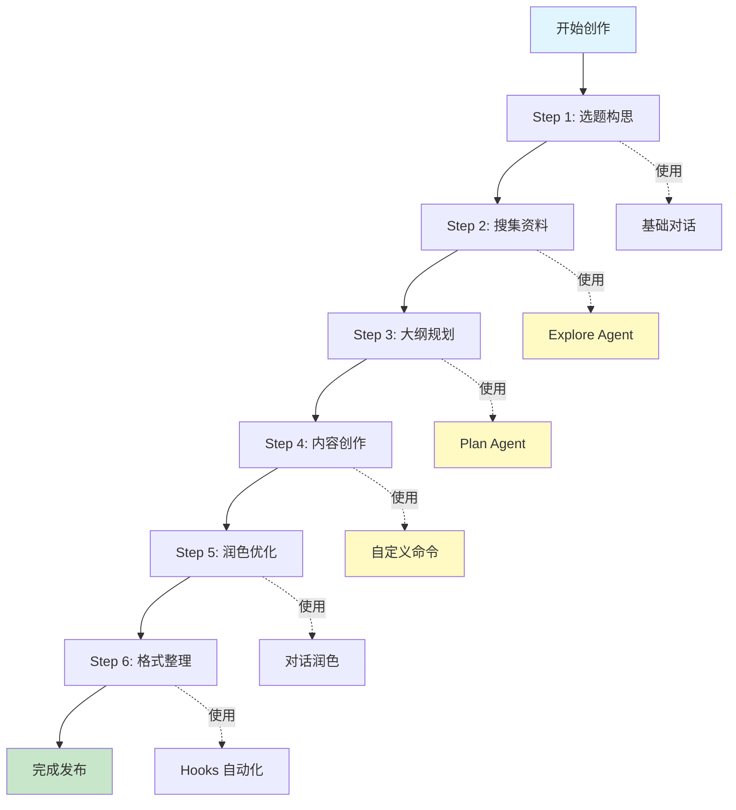

# 08 - 实战案例：完整文章创作流程

## 本章目标

通过一个完整的实战案例，带你从零到一创作一篇公众号文章《AI 时代的个人成长系统》。你将学会：

- 如何用 Claude Code 进行选题构思和头脑风暴
- 如何让 Explore Agent 帮你搜集资料
- 如何用 Plan Agent 规划文章结构
- 如何创建自定义命令提升创作效率
- 如何用对话润色优化文章
- 如何用 Hooks 自动整理格式

这是一个完整的端到端流程，每一步都有真实的对话示例，拿来就能用！

---

## 案例背景：我们要写什么文章

**目标文章**：《AI 时代的个人成长系统》

**文章定位**：
- 面向职场人士和自媒体创作者
- 内容深度：中等（不是科普文，也不是纯理论）
- 字数要求：3000-4000 字
- 核心价值：帮助读者建立适应 AI 时代的成长方法论

**为什么选这个选题**？
因为这是当下最热门的话题，同时也是公众号读者最关心的内容。通过这个案例，你会看到如何把一个宏大的话题，拆解成有结构、有深度、可落地的文章。

---

## 完整流程图



整个流程需要 1-2 小时（取决于你的写作速度）。现在让我们一步步来！

---

## Step 1: 选题构思（基础对话）

### 你说的话

```
我想写一篇公众号文章，主题是「AI 时代的个人成长」，
但感觉这个话题太大了，不知道从哪里入手。

我的读者主要是：
- 25-35 岁的职场人士
- 对 AI 工具有一定了解，但不是技术专家
- 希望通过学习提升职场竞争力

你能帮我头脑风暴一下，这个选题可以从哪些角度切入吗？
```

### Claude 的回复示例

```
这个选题很棒！确实有点大，我们来收窄一下范围。

我给你几个切入角度：

1. **能力模型角度**：AI 时代需要哪些新能力？
   - 提示词工程能力
   - AI 辅助决策能力
   - 持续学习能力
   优点：实用性强，容易给出方法论
   缺点：可能太偏工具层面

2. **成长系统角度**：如何构建一套适应 AI 的成长系统？
   - 输入系统：如何高效获取信息
   - 处理系统：如何用 AI 提升效率
   - 输出系统：如何创造独特价值
   优点：结构完整，有深度
   缺点：需要一定理论支撑

3. **对比反差角度**：AI 时代 vs 传统时代，个人成长有什么不同？
   - 学习方式的改变
   - 工作方式的改变
   - 价值创造的改变
   优点：容易引发共鸣
   缺点：可能太宏观

根据你的读者画像，我推荐 **角度 2：成长系统角度**。

因为：
- 你的读者需要的是一套完整方法论，而不是零散的技巧
- "系统"这个词会让文章显得更专业、更有深度
- 可以融入具体案例，避免纯理论

标题可以改成：《AI 时代的个人成长系统：输入-处理-输出三步法》

你觉得这个方向怎么样？
```

**【这里放截图：对话界面】**

### 你的决策

```
很好！就用「成长系统」这个角度。
标题我再优化一下：《AI 时代的个人成长系统：如何用三步法建立你的竞争力》

接下来我需要搜集一些资料，包括：
- AI 工具对个人成长的影响
- 其他创作者是怎么写这个话题的
- 有没有相关的理论框架可以参考

能帮我搜集一下吗？
```

---

## Step 2: 搜集资料（Explore Agent）

### 你说的话

```
@Explore 帮我搜集以下资料：

1. 搜索「AI 个人成长」「AI 时代能力模型」相关的优质文章
2. 搜索有没有「输入-处理-输出」这种成长模型的理论依据
3. 搜索当下最火的 AI 工具（ChatGPT、Claude、Notion AI 等）对个人成长的实际影响

请帮我整理成一个结构化的资料库。
```

### Explore Agent 的工作过程

**【这里放截图：Explore Agent 搜索中】**

Explore Agent 会：
1. 使用 WebSearch 搜索相关内容
2. 用 Grep 在你的本地文件中搜索是否有相关笔记
3. 整理成结构化的资料清单

### Explore Agent 的输出示例

```
资料搜集完成！以下是整理结果：

## 一、相关理论框架

1. **DIKW 模型**（数据-信息-知识-智慧）
   - 来源：信息科学经典模型
   - 适用性：可以对应「输入-处理-输出」三步法
   - 参考链接：[DIKW Pyramid](https://example.com)

2. **费曼学习法**
   - 核心：输入→理解→输出教学
   - 适用性：可以作为「输出系统」的理论支撑

## 二、优质文章参考

1. 《ChatGPT 如何改变我的工作方式》（阅读量 10w+）
   - 核心观点：AI 不是取代人，而是放大人的能力
   - 可借鉴点：大量实际案例

2. 《为什么你学不会 AI？因为你的学习系统错了》
   - 核心观点：传统学习系统在 AI 时代失效
   - 可借鉴点：对比反差的写作手法

## 三、热门 AI 工具及影响

| 工具 | 主要用途 | 对个人成长的影响 |
|------|---------|---------------|
| ChatGPT | 对话、写作、编程 | 降低创作门槛，提升输出效率 |
| Claude | 深度思考、长文本 | 提升思维深度，辅助决策 |
| Notion AI | 笔记整理、知识管理 | 优化信息处理流程 |
| Midjourney | 图像生成 | 降低视觉表达门槛 |

## 四、数据支撑

- 根据 McKinsey 报告，AI 可以提升知识工作者 30-40% 的效率
- 根据 GitHub 调查，55% 的开发者认为 AI 让他们更专注于创造性工作

这些资料足够支撑你的文章了。需要我补充搜集其他内容吗？
```

**【这里放截图：资料整理结果】**

### 你的决策

```
完美！资料很全面。

现在我需要你帮我规划文章结构，
把这些资料融入到「输入-处理-输出」三步法中。
```

---

## Step 3: 大纲规划（Plan Agent）

### 你说的话

```
@Plan 帮我规划文章《AI 时代的个人成长系统》的结构

要求：
- 采用「输入-处理-输出」三步法框架
- 每个部分都要有具体案例
- 总字数控制在 3000-4000 字
- 开头要有痛点引入，结尾要有行动指南

请给我一个详细的大纲，包括每个部分的字数分配和核心要点。
```

### Plan Agent 的输出示例

```
文章大纲规划完成！

## 《AI 时代的个人成长系统：如何用三步法建立你的竞争力》

**目标字数**：3500 字
**预计阅读时间**：8 分钟

---

### 一、开头：痛点引入（400 字）

**核心要点**：
- 痛点 1：学了很多 AI 工具，但感觉没什么用
- 痛点 2：看别人用 AI 很厉害,自己却不知道从哪开始
- 痛点 3：担心被 AI 取代，但又不知道怎么提升

**写作建议**：
- 用一个真实故事开头（可以是你自己的，也可以是读者投稿）
- 抛出核心问题：为什么你学不会 AI？因为你缺乏一套系统
- 引出文章主题：我总结的「输入-处理-输出」三步法

---

### 二、为什么需要一套成长系统？（500 字）

**核心要点**：
- AI 时代的本质变化：从「知识稀缺」到「注意力稀缺」
- 传统学习方法失效的原因
- 什么是「输入-处理-输出」系统

**写作建议**：
- 用对比表格：传统时代 vs AI 时代
- 引用数据：McKinsey 报告（30-40% 效率提升）
- 给出系统的定义和框架图

---

### 三、第一步：输入系统（900 字）

**核心要点**：
- 输入的本质：不是收集信息,而是建立信息过滤器
- 三个输入原则：
  1. 主题驱动（不要被算法绑架）
  2. 深度优先（少而精，而不是多而杂）
  3. 及时处理（不要囤积）

**具体案例**：
- 案例 1：如何用 AI 建立个人资讯库（Notion AI + RSS）
- 案例 2：如何用 AI 过滤噪音（ChatGPT 总结长文）
- 案例 3：如何用 AI 深度学习（Claude 辅助思考）

**工具推荐**：
- Feedly（RSS 订阅）
- Notion AI（笔记整理）
- ChatGPT（信息总结）

---

### 四、第二步：处理系统（900 字）

**核心要点**：
- 处理的本质：把信息转化为自己的知识
- 三个处理方法：
  1. AI 辅助提问（用苏格拉底式提问法深化思考）
  2. 结构化整理（用思维导图、表格等工具）
  3. 关联旧知识（建立知识网络）

**具体案例**：
- 案例 1：如何用 ChatGPT 进行苏格拉底式对话
- 案例 2：如何用 Claude 整理读书笔记
- 案例 3：如何用 AI 建立个人知识图谱

**工具推荐**：
- Claude（深度对话）
- Obsidian（知识网络）
- Xmind（思维导图）

---

### 五、第三步：输出系统（900 字）

**核心要点**：
- 输出的本质：通过教学来巩固学习
- 三个输出方式：
  1. 写作输出（公众号、知乎、小红书）
  2. 分享输出（内部培训、社群讨论）
  3. 产品输出（把知识变成工具或服务）

**具体案例**：
- 案例 1：如何用 ChatGPT 辅助写作（从大纲到初稿）
- 案例 2：如何用 AI 准备分享（PPT 生成、演讲稿）
- 案例 3：如何把知识变成产品（做一个 AI 工具集）

**工具推荐**：
- ChatGPT（写作助手）
- Gamma（AI 生成 PPT）
- Claude Code（代码生成）

---

### 六、如何开始：21 天行动计划（400 字）

**核心要点**：
- 第 1 周：建立输入系统（选 3 个优质信息源）
- 第 2 周：建立处理系统（每天用 AI 深度思考 1 个问题）
-第 3 周：建立输出系统（写 3 篇文章或做 1 次分享）

**写作建议**：
- 给出具体的每日任务清单
- 强调：不要追求完美，先跑起来
- 留下互动钩子：欢迎在评论区打卡

---

### 七、结尾：金句 + CTA（400 字）

**核心要点**：
- 金句：AI 不会取代你，但会用 AI 的人会取代你
- 行动召唤：
  - 点赞收藏（方便以后查阅）
  - 评论区分享你的成长系统
  - 扫码加入成长社群

**写作建议**：
- 首尾呼应，回到开头的痛点
- 给读者信心：这套系统是我亲测有效的
- 留下彩蛋：后续会分享更多 AI 工具使用技巧

---

## 字数分配总结

| 部分 | 字数 | 占比 |
|------|------|------|
| 开头 | 400 | 11% |
| 为什么需要系统 | 500 | 14% |
| 输入系统 | 900 | 26% |
| 处理系统 | 900 | 26% |
| 输出系统 | 900 | 26% |
| 行动计划 | 400 | 11% |
| 结尾 | 400 | 11% |
| **总计** | **4400** | **125%** |

（实际写作时可以适当压缩）

---

这个大纲够详细了吗？需要调整哪个部分？
```

**【这里放截图：Plan Agent 的大纲】**

### 你的决策

```
大纲很完美！

现在开始创作。为了提高效率，我想创建一个自定义命令 /写文章，
能够按照这个大纲逐步完成创作。

你能帮我设计这个命令吗?
```

---

## Step 4: 内容创作（自定义命令）

### 创建自定义命令

首先，你需要创建一个自定义命令文件：

**文件路径**：`~/.claude/commands/写文章.md`

```markdown
---
name: 写文章
description: 根据大纲分段创作文章内容
---

你是一个资深的公众号写作助手。

## 任务

根据用户提供的大纲，逐段完成文章创作。

## 写作要求

1. **风格**：
   - 口语化、接地气
   - 多用短句，避免长难句
   - 适当使用反问、排比等修辞手法

2. **结构**：
   - 每段有明确的主题句
   - 逻辑清晰，层次分明
   - 善用小标题、列表、表格

3. **案例**：
   - 必须是真实可操作的
   - 给出具体步骤
   - 避免泛泛而谈

4. **数据**：
   - 引用权威来源
   - 数据要准确
   - 避免过度堆砌

## 工作流程

1. 询问用户要写哪个部分
2. 根据大纲提供的要点进行创作
3. 完成后询问是否需要修改
4. 继续下一部分

开始吧！
```

### 使用自定义命令

**你说的话**：

```
/写文章

我要写「开头：痛点引入」这部分，大纲要点是：
- 痛点 1：学了很多 AI 工具，但感觉没什么用
- 痛点 2：看别人用 AI 很厉害,自己却不知道从哪开始
- 痛点 3：担心被 AI 取代，但又不知道怎么提升

请帮我写一个 400 字的开头，用真实故事引入。
```

### Claude 的创作示例

```
好的！以下是开头部分：

---

上个月，朋友小李跟我吐槽：

"我花了 3 个月学 AI 工具，ChatGPT、Claude、Notion AI 都用上了，
但工作效率好像没什么变化。反而每天更焦虑了，总觉得自己学得不够快。"

小李的问题，可能也是你的问题。

你看到朋友圈里，有人用 ChatGPT 10 分钟写出一篇爆款文章，
有人用 Claude 半小时搞定一份商业分析报告，
有人用 Midjourney 生成的海报比设计师做的还好看。

你也想成为这样的人，于是：
- 收藏了 50+ 篇 AI 教程（但没看完）
- 下载了 20+ 个 AI 工具（但不知道怎么用）
- 加入了 10+ 个 AI 社群（但从不发言）

结果呢？

你还是不会用 AI。更糟糕的是，你开始担心：会用 AI 的人会不会取代我？

其实，**你不是学不会 AI，而是缺少一套系统**。

今天这篇文章,我要分享我实践了半年的「AI 成长系统」，
帮你从信息焦虑中解脱出来，真正把 AI 变成你的超级助手。

这套系统只有三步：输入、处理、输出。

看完你就知道，为什么有人用 AI 起飞，而你还在原地打转。

---

这个开头怎么样？需要调整哪里吗？

还是继续写下一部分？
```

**【这里放截图：创作过程】**

### 继续创作

按照这个节奏，你可以逐段完成：
- 第二部分：为什么需要系统（500 字）
- 第三部分：输入系统（900 字）
- 第四部分：处理系统（900 字）
- 第五部分：输出系统（900 字）
- 第六部分：行动计划（400 字）
- 第七部分：结尾（400 字）

每完成一部分，Claude 都会问你：**"这部分满意吗？需要修改吗？"**

如果满意，就说：**"继续下一部分"**。

---

## Step 5: 润色优化（对话）

文章初稿完成后，需要进行润色优化。

### 你说的话

```
文章初稿完成了，但我觉得有些地方还可以优化：

1. 整体语言偏书面化，不够口语
2. 案例部分有点干，缺少画面感
3. 数据引用有点生硬，需要更自然地融入

能帮我逐段润色一下吗？先从开头开始。
```

### Claude 的润色示例

**原版（书面化）**：

```
AI 工具的普及改变了知识工作的方式。
根据 McKinsey 的研究报告，AI 可以提升知识工作者 30-40% 的工作效率。
因此，掌握 AI 工具已经成为职场必备技能。
```

**润色后（口语化）**：

```
你知道吗？AI 已经悄悄改变了我们的工作方式。

McKinsey 做过一个调查，发现会用 AI 的知识工作者，
效率比别人高 30-40%。

什么概念？

原来你 8 小时才能干完的活，现在 5 小时就搞定了。
多出来的 3 小时，你可以学新东西、可以陪家人、可以刷剧。

所以啊，AI 不是选修课，是必修课。
```

**【这里放截图：润色对比】**

### 持续优化

你可以继续提出具体的润色需求：

```
- "第三部分的案例太抽象了，能不能给一个更具体的场景？"
- "结尾的金句有点平淡，能不能更有冲击力？"
- "行动计划的步骤太多了，能简化成 3 步吗？"
```

Claude 会根据你的反馈，持续优化文章。

---

## Step 6: 格式整理（Hooks 自动化）

文章内容完成后，还需要整理格式。这时候可以用 Hooks 自动化。

### 创建格式整理 Hook

**文件路径**：`~/.claude/hooks/format-article.md`

```markdown
---
name: format-article
trigger: on_file_save
match: "**/*article*.md"
---

当保存文章文件时，自动执行以下格式整理：

1. **标题规范**：
   - 一级标题只有一个（文章标题）
   - 二级标题前后各空一行
   - 三级标题前空一行

2. **段落规范**：
   - 段落之间空一行
   - 列表项之间不空行
   - 代码块前后各空一行

3. **标点规范**：
   - 统一使用中文标点
   - 数字和单位之间加空格（例如：30 天）
   - 英文单词和中文之间加空格

4. **链接规范**：
   - 外部链接用脚注形式
   - 图片统一用相对路径

5. **添加元信息**：
   - 文件开头添加：
     - 标题
     - 字数统计
     - 预计阅读时间
     - 最后修改时间

执行完毕后，告诉用户：
"文章格式已自动整理完成！字数：X 字，预计阅读时间：X 分钟"
```

### 保存时自动触发

当你保存文章文件时（例如 `article-ai-growth.md`），
Hook 会自动触发，整理格式。

**【这里放截图：Hook 自动执行】**

### 格式整理前后对比

**整理前**：

```markdown
# AI时代的个人成长系统
上个月，朋友小李跟我吐槽：
"我花了3个月学AI工具，ChatGPT、Claude、Notion AI都用上了，但工作效率好像没什么变化。"
小李的问题，可能也是你的问题。
## 为什么需要系统？
AI工具的普及改变了知识工作的方式。McKinsey的研究报告显示...
```

**整理后**：

```markdown
---
title: AI 时代的个人成长系统
wordcount: 3524
reading_time: 8 分钟
last_modified: 2025-12-14
---

# AI 时代的个人成长系统：如何用三步法建立你的竞争力

上个月，朋友小李跟我吐槽：

"我花了 3 个月学 AI 工具，ChatGPT、Claude、Notion AI 都用上了，
但工作效率好像没什么变化。"

小李的问题，可能也是你的问题。

## 为什么需要系统？

AI 工具的普及改变了知识工作的方式。根据 McKinsey 的研究报告显示...
```

---

## 最终成果展示

恭喜！经过 6 个步骤，你的文章已经完成了！

### 最终文章结构

```
AI 时代的个人成长系统：如何用三步法建立你的竞争力

├── 一、开头：痛点引入（400 字）
├── 二、为什么需要系统？（500 字）
├── 三、输入系统（900 字）
│   ├── 输入原则
│   ├── 案例 1：建立资讯库
│   ├── 案例 2：过滤噪音
│   └── 案例 3：深度学习
├── 四、处理系统（900 字）
│   ├── 处理方法
│   ├── 案例 1：苏格拉底式对话
│   ├── 案例 2：整理读书笔记
│   └── 案例 3：建立知识图谱
├── 五、输出系统（900 字）
│   ├── 输出方式
│   ├── 案例 1：辅助写作
│   ├── 案例 2：准备分享
│   └── 案例 3：知识产品化
├── 六、21 天行动计划（400 字）
└── 七、结尾：金句 + CTA（400 字）

总字数：4400 字
预计阅读时间：10 分钟
```

### 文章质量检查清单

在发布前，用这个清单检查一遍：

- [ ] **标题**：有吸引力吗？包含关键词了吗？
- [ ] **开头**：前 3 句话能抓住读者吗？
- [ ] **结构**：逻辑清晰吗？小标题醒目吗？
- [ ] **案例**：具体可操作吗？有画面感吗？
- [ ] **数据**：准确可信吗？来源标注了吗？
- [ ] **语言**：口语化吗？有错别字吗？
- [ ] **排版**：段落分明吗？格式统一吗？
- [ ] **结尾**：有行动召唤吗？留下钩子了吗？

全部打勾？那就可以发布了！

---

## 经验总结

完成这个完整案例后，我们来总结一下关键经验：

### 1. 不要一上来就写

很多人的误区是：打开文档就开始写。

正确的流程应该是：**构思 → 搜集 → 规划 → 创作 → 润色 → 整理**

前面 3 步（构思、搜集、规划）占了 50% 的时间，
但决定了后面 80% 的质量。

### 2. 善用 Agent 分工

| Agent | 擅长什么 | 不擅长什么 |
|-------|---------|-----------|
| 基础对话 | 头脑风暴、快速反馈 | 大规模搜索、复杂规划 |
| Explore Agent | 搜集资料、整理信息 | 创意构思、润色文字 |
| Plan Agent | 结构规划、任务拆解 | 具体创作、风格调整 |
| Task Agent | 批量处理、格式整理 | 需要主观判断的任务 |

不要让一个 Agent 干所有的活，要学会"专业的事交给专业的 Agent"。

### 3. 自定义命令是效率神器

如果你经常写同类型的文章（例如都是公众号文章），
强烈建议创建自定义命令，把你的写作风格、要求固化下来。

这样每次创作都是"一键启动"，省去大量重复沟通。

### 4. Hooks 自动化格式整理

格式整理是个体力活，但又很重要（影响阅读体验）。

用 Hooks 自动化后，你只需要专注内容，格式交给 Claude 就好。

### 5. 保持对话式创作

不要把 Claude 当成"工具"，而要当成"写作搭档"。

随时提出你的想法、疑问、不满意的地方，
Claude 会根据你的反馈持续优化。

这种"对话式创作"比传统的"单向输出"效率高得多。

### 6. 迭代优化而不是追求完美

第一稿不需要完美，先跑起来，再慢慢优化。

Claude Code 的优势就是可以快速迭代：
- 初稿 → 润色 → 再润色 → 最终版

每一轮都会更好一点，最终会达到你满意的状态。

---

## 你的作业

现在轮到你了！

**作业**：用同样的流程，创作一篇你自己的公众号文章。

**建议选题**：
- 《我用 Claude Code 提升工作效率的 7 个技巧》
- 《普通人如何用 AI 打造个人 IP》
- 《自媒体创作者必备的 10 个 AI 工具》

**作业要求**：
- 严格按照 6 个步骤执行
- 记录每一步的对话过程（截图）
- 最终提交完整文章 + 创作过程复盘

**提交方式**：
- 在评论区贴出你的文章链接
- 或者加入社群分享你的创作过程

我会挑选 3 篇优秀作业，送出 Claude Pro 月卡！

---

## 下一章预告

学会了完整的文章创作流程，下一章我们来点不一样的：

**09 - 实战案例：用 Claude Code 做数据分析**

你将学会：
- 如何让 Claude 帮你清洗数据
- 如何用 Python 做可视化分析
- 如何生成数据分析报告

不需要编程基础，也能做专业级数据分析！

---

**本章完成！你已经掌握了完整的文章创作流程！**

如果有任何问题，随时在评论区提问，我会第一时间回复你。

加油，未来的爆款文章作者！
