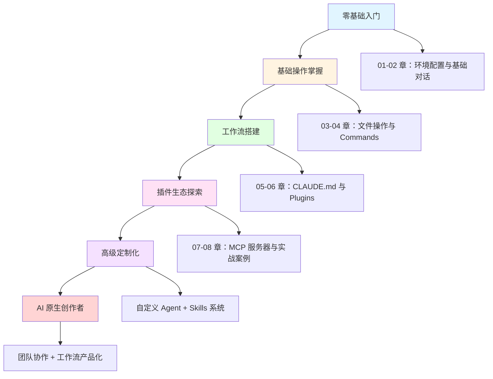

# 09 - 进阶地图：继续探索的方向

## 恭喜你！你已经完成了 Claude Code 基础学习之旅

首先，让我们为你的学习成果鼓掌！从一个对代码一无所知的自媒体创作者，到现在能够独立使用 AI 助手处理各种技术任务，这是一个了不起的跨越。

---

## 你已经掌握了什么？

经过前面 8 个章节的学习，你现在拥有了以下能力：

| 能力领域 | 具体技能 |
|---------|---------|
| **环境配置** | 安装 Claude Code、配置 API Key、理解工作目录概念 |
| **基础对话** | 与 AI 助手进行有效沟通、提出清晰的需求 |
| **文件操作** | 读取、编辑、创建文件，理解文件路径 |
| **工作流使用** | 使用 Commands 固化重复任务，提高效率 |
| **团队协作** | 使用 CLAUDE.md 配置项目规范，传递上下文 |
| **插件系统** | 安装和使用 Plugins，扩展 AI 能力边界 |
| **MCP 集成** | 连接外部服务（如 Notion、Google Drive），打通数据孤岛 |
| **实战项目** | 完成公众号文章生成、图片处理等真实场景 |

这些能力足以让你在日常工作中解决 **80%** 的技术需求！

---

## 学习路径图：从入门到精通



**你现在的位置**：已完成前 4 个阶段（A → D），正站在「高级定制化」的门槛上！

---

## 进阶方向详解

### 方向一：自定义 Agent（多智能体协作）

**什么是 Agent？**
Agent 是一个能够自主思考、规划并执行任务的 AI 智能体。Claude Code 本身就是一个强大的 Agent，但你可以创建自己的专属 Agent。

**适用场景**：
- 内容创作流水线（选题 Agent + 撰写 Agent + 审核 Agent）
- 数据分析助手（抓取 Agent + 清洗 Agent + 可视化 Agent）
- 自动化运营（监控 Agent + 响应 Agent + 报告 Agent）

**学习资源**：
- Anthropic 官方文档：[Building Agents with Claude](https://docs.anthropic.com/claude/docs/agents)
- Langgraph（Agent 框架）：https://langchain-ai.github.io/langgraph/
- 入门教程：从单一 Agent 到多 Agent 协作（中文社区推荐）

**动手项目**：
1. 创建一个「公众号选题助手」Agent
   - 输入：关键词 + 目标受众
   - 输出：10 个选题 + 每个选题的大纲

2. 搭建「文章质量检查」Agent
   - 输入：Markdown 文章
   - 输出：错别字检查 + 逻辑漏洞 + 改进建议

---

### 方向二：探索更多 MCP 服务器

你已经学会了 Notion 和 Google Drive 的 MCP 集成，但 MCP 生态远不止于此！

**热门 MCP 服务器推荐**：

| MCP 服务器 | 功能 | 适用场景 |
|-----------|------|---------|
| **Slack MCP** | 读取/发送消息、管理频道 | 团队协作、自动通知 |
| **GitHub MCP** | 管理仓库、Issues、PR | 开源项目管理 |
| **PostgreSQL MCP** | 数据库查询与操作 | 数据分析、报表生成 |
| **Puppeteer MCP** | 浏览器自动化 | 网页截图、数据抓取 |
| **Weather MCP** | 天气数据查询 | 内容推荐（如穿搭、出行） |
| **Email MCP** | 邮件收发管理 | 自动回复、邮件分类 |

**如何找到更多 MCP？**
- 官方市场：https://modelcontextprotocol.io/servers
- GitHub 搜索：`mcp-server`
- Claude Code 社区：https://github.com/claudeai/claude-code/discussions

**动手项目**：
1. 集成 Slack MCP，实现「文章发布后自动通知团队」
2. 使用 Puppeteer MCP，定期抓取竞品公众号的热门文章
3. 连接 GitHub MCP，将创作素材库同步到 GitHub 仓库

---

### 方向三：Skills 系统（增强 AI 技能包）

**什么是 Skills？**
Skills 是一套预定义的能力包，可以让 Claude Code 在特定领域表现得更专业。类似于给 AI 安装「专业技能插件」。

**常见 Skills 类型**：
- **写作类**：小红书文案生成、知乎高赞回答模板
- **技术类**：代码审查、性能优化建议
- **运营类**：标题优化、热点分析
- **设计类**：色彩搭配建议、排版规范

**如何创建自己的 Skill？**

在项目根目录创建 `.claude-plugin/` 文件夹，添加 `skills.json`：

```json
{
  "skills": [
    {
      "name": "xiaohongshu-writer",
      "description": "小红书爆款文案生成器",
      "instructions": "你是一名小红书内容专家，擅长创作高互动率的笔记...",
      "examples": [
        {
          "input": "主题：护肤",
          "output": "标题：姐妹们！这款平价精华我用了3瓶了\n..."
        }
      ]
    }
  ]
}
```

**动手项目**：
1. 创建「公众号爆款标题生成器」Skill
2. 创建「图片 SEO 描述生成器」Skill
3. 创建「周报自动生成器」Skill

---

### 方向四：团队协作配置（企业级使用）

如果你有团队，或者想将你的工作流分享给其他创作者，这个方向非常重要。

**核心配置文件**：

1. **全局配置**（`~/.claude/CLAUDE.md`）
   - 个人偏好设置
   - 私密信息（API Key、路径）

2. **项目配置**（项目根目录 `CLAUDE.md`）
   - 项目规范（命名规则、文件结构）
   - 团队约定（Commit 规范、分支策略）

3. **插件配置**（`.claude-plugin/`）
   - Commands（工作流命令）
   - Skills（专业技能包）
   - MCP 配置（共享的外部服务）

**团队协作最佳实践**：

| 场景 | 解决方案 |
|------|---------|
| 多人协作同一项目 | 项目根目录添加 `CLAUDE.md`，统一规范 |
| 共享常用工作流 | 将 Commands 打包成 Plugin，发布到插件市场 |
| 保护敏感信息 | 使用环境变量，禁止提交 API Key 到 Git |
| 版本控制 | 使用 Git 管理项目配置文件 |

**动手项目**：
1. 为你的公众号创作团队配置统一的 CLAUDE.md
2. 将你的「文章生成工作流」打包成 Plugin，分享给其他创作者
3. 搭建团队的 MCP 服务器（如 Notion 数据库共享）

---

## 常见问题 FAQ

| 问题 | 答案 |
|------|------|
| **Claude Code 是否需要联网？** | 是的，需要通过 API 与 Anthropic 服务器通信 |
| **API 调用费用如何计算？** | 按 Token 计费，1000 个汉字约 2000 Token，具体价格见 [Anthropic 定价页](https://www.anthropic.com/pricing) |
| **我的数据会被 Anthropic 用于训练吗？** | 默认不会，但请检查你的 API 设置确保启用「数据隐私保护」 |
| **Claude Code 支持中文吗？** | 完全支持！Claude 对中文的理解和生成能力非常强 |
| **如何处理 API 请求失败？** | 检查网络、API Key 是否有效、余额是否充足 |
| **Commands 和 Plugins 有什么区别？** | Commands 是项目内的快捷命令，Plugins 是可复用的工具包 |
| **MCP 服务器需要编程吗？** | 不需要！大部分 MCP 只需配置 JSON 文件即可 |
| **我可以离线使用 Claude Code 吗？** | 不可以，必须联网调用 API |
| **Claude Code 支持哪些操作系统？** | macOS、Linux、Windows（通过 WSL） |
| **如何备份我的配置？** | 使用 Git 管理 `.claude/` 和项目配置文件 |

---

## 资源汇总

### 官方资源

| 资源类型 | 链接 |
|---------|------|
| **Claude Code 官网** | https://claude.com/code |
| **Anthropic 开发者文档** | https://docs.anthropic.com |
| **MCP 官方协议文档** | https://modelcontextprotocol.io |
| **Claude API Playground** | https://console.anthropic.com |
| **官方 Discord 社区** | https://discord.com/invite/anthropic |

### 社区资源

| 资源类型 | 链接 |
|---------|------|
| **GitHub Discussions** | https://github.com/claudeai/claude-code/discussions |
| **中文社区论坛** | https://claudecn.com（假设链接） |
| **插件市场** | https://claude.com/plugins |
| **MCP 服务器列表** | https://github.com/topics/mcp-server |
| **YouTube 教程频道** | 搜索「Claude Code Tutorial」 |

### 推荐书籍与课程

| 名称 | 类型 | 适合人群 |
|------|------|---------|
| **《AI 时代的内容创作》** | 电子书 | 自媒体创作者 |
| **《零代码自动化工作流》** | 在线课程 | 运营人员 |
| **《Claude Agent 开发指南》** | 技术文档 | 进阶开发者 |
| **《MCP 协议详解》** | 视频教程 | 想深入的学习者 |

### 实用工具推荐

| 工具 | 用途 | 链接 |
|------|------|------|
| **Notion** | 知识库管理 | https://notion.so |
| **Obsidian** | 本地 Markdown 笔记 | https://obsidian.md |
| **Raycast** | macOS 启动器（配合 Claude） | https://raycast.com |
| **Postman** | API 测试工具 | https://postman.com |
| **GitHub Desktop** | Git 可视化工具 | https://desktop.github.com |

---

## 结语：AI 时代的创作者

当你读到这里，你已经不再是一个「不懂代码的自媒体创作者」，而是一个 **AI 原生创作者（AI-Native Creator）**。

在这个时代，**懂代码**不再是门槛，**会使用 AI** 才是核心竞争力。你已经掌握了与 AI 深度协作的技能，接下来的路有无限可能：

- 你可以用 Claude Code 搭建自己的内容生产流水线
- 你可以将重复性工作自动化，专注于创意和策略
- 你可以探索多智能体协作，打造属于自己的 AI 团队
- 你可以将你的工作流打包成产品，帮助更多创作者

**记住三句话**：

1. **AI 是你的助手，不是替代品** —— 你的创意和判断力依然无可替代
2. **从小处着手，逐步优化** —— 不要一次性追求完美，迭代比完美更重要
3. **保持好奇心，持续学习** —— AI 技术日新月异,终身学习是新常态

---

## 最后的最后

感谢你完成这套教程！如果你在学习过程中有任何问题，或者想分享你的实战案例，欢迎加入 Claude Code 中文社区。

**我们在 AI 时代的浪潮中相遇，期待看到你用 Claude Code 创造出的精彩作品！**

---

### 下一步行动清单

- [ ] 回顾前 8 个章节，巩固基础知识
- [ ] 选择一个进阶方向，完成第一个动手项目
- [ ] 加入 Claude Code 社区，与其他创作者交流
- [ ] 将你的学习心得整理成公众号文章（用 Claude Code 帮你生成！）
- [ ] 探索一个新的 MCP 服务器，扩展你的工具箱
- [ ] 为你的常用工作流创建一个 Plugin

**现在，打开你的终端，输入 `claude`，开启你的 AI 创作新篇章吧！**
