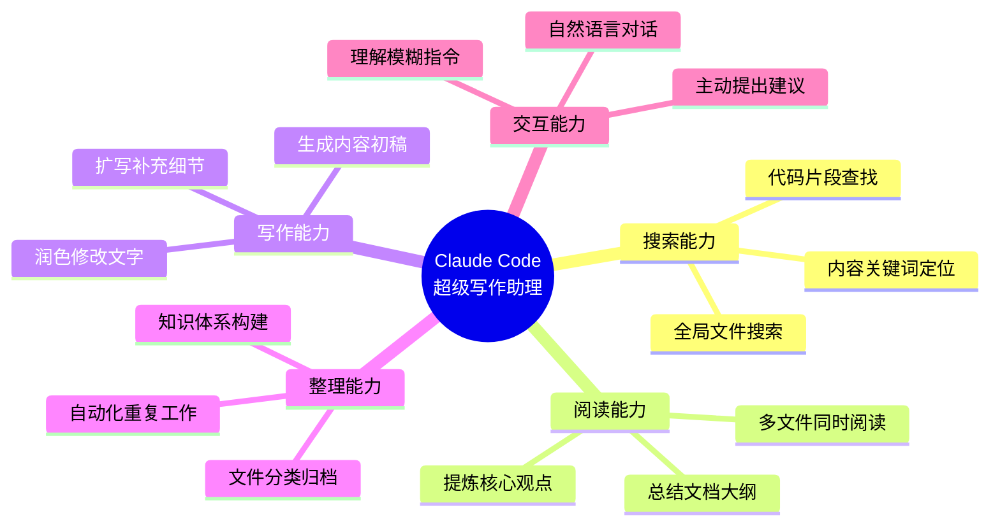
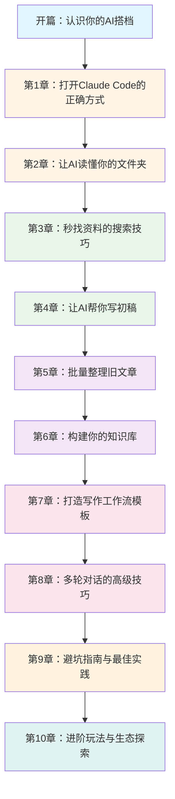

# 00 开篇：你的 AI 写作搭档

## 🎉 你即将拥有一个超级助理

想象一下，如果有这样一位助理：

- 📚 **瞬间记忆力**：能同时记住你电脑里几千个文件的内容
- 🔍 **秒速搜索力**：1 秒内找到你 3 年前写的某句话
- ✍️ **智能创作力**：帮你整理思路、润色文字、生成大纲
- 🔄 **永不疲倦**：24 小时待命，不会因为你半夜灵感来临而抱怨

这不是科幻小说，这就是 **Claude Code** —— 一个住在你电脑里的超级写作助理。

---

## 🤝 从生活助理到 AI 助理

让我们先建立一个认知框架。你可以这样类比：

| 场景 | 普通助理 | Claude Code |
|------|----------|------------|
| 🔍 **找资料** | "帮我翻翻文件柜，找去年的策划案" | "瞬间搜遍所有文件，精准定位" |
| 📖 **读文档** | "这 50 页报告你先看完跟我说重点" | "3 秒读完，提炼核心观点" |
| ✍️ **写内容** | "帮我整理下这些采访记录" | "自动分类、提炼金句、生成初稿" |
| 🗂️ **管理文件** | "把相关文件归类整理好" | "自动识别关联内容，建立知识体系" |

**关键差异**：普通助理需要你详细指导每一步，Claude Code 理解你的意图，主动帮你完成整个流程。

---

## 🗺️ Claude Code 的核心能力地图

**重点理解**：
- 不需要写代码，用大白话跟它对话就行
- 它不是一个工具，而是一个懂你的工作伙伴
- 你的文件越多，它越能发挥价值

---

## 📖 贯穿案例：从灵感到发布的完整创作流程

在接下来的教程里，我们会用一个真实场景串联所有知识点：

**场景：创作一篇公众号文章《AI 如何帮我每周节省 10 小时》**

### 整个流程会涉及

1. **灵感捕捉**：用 Claude Code 搜索你之前写过的相关笔记
2. **资料整理**：让它帮你总结 5 篇参考文章的核心观点
3. **大纲生成**：根据资料自动生成文章框架
4. **内容创作**：分段写作，Claude Code 帮你润色
5. **案例补充**：搜索你之前的实战经验，插入真实案例
6. **最终发布**：检查格式、生成摘要、优化标题

这不是演示，这是你未来每周都会用到的真实工作流。

---

## 🛤️ 学习路径：10 个章节的进阶之旅

**学习节奏建议**：
- 第 1-3 章：基础操作（1 天掌握）
- 第 4-6 章：实战应用（边学边用 1 周）
- 第 7-10 章：高级技巧（持续探索）

---

## ✅ 准备工作检查清单

在开始学习之前，请确认：

### 必备条件
- [ ] 已安装 VS Code
- [ ] 已安装 Claude Code 插件
- [ ] 有至少 10 个文本文件（文章、笔记、素材都行）

### 推荐准备
- [ ] 整理一个「创作素材」文件夹
- [ ] 准备一个想写的选题（我们会一起完成它）
- [ ] 建立「学习实验」文件夹（随时记录学习心得）

### 心态准备
- [ ] 相信 AI 是助手，不是替代品
- [ ] 接受前几次对话可能不够默契
- [ ] 保持好奇心，大胆尝试各种问法

---

## 🚀 你准备好了吗？

如果你已经确认完成上面的检查清单，那么恭喜你！

你即将开启一段全新的创作体验。在接下来的旅程中，你会发现：

- **写作不再孤独**：每个灵感都有 AI 帮你捕捉和扩展
- **资料不再混乱**：所有素材都能秒速定位和整合
- **创作不再卡顿**：从大纲到初稿，AI 帮你搭建框架

更重要的是，你会拥有一个 **可复用的创作系统**，让每周产出优质内容成为轻松的事。

---

## 📌 下一章预告

**第 1 章：打开 Claude Code 的正确方式**

我们会手把手教你：
- 如何在 VS Code 里唤醒 Claude Code
- 第一次对话应该说什么
- 如何让 AI 理解你的文件结构

现在，让我们开始吧！👉

---

> 💡 **小提示**：每一章结束后，都有配套的实战小练习。建议你跟着做，而不是只看不练。创作能力的提升，在于行动而非阅读。

> 📮 **交流建议**：在学习过程中有任何疑问，可以直接问 Claude Code："我在学教程第 X 章，遇到了 XX 问题，怎么办？" —— 它会根据你的实际情况给建议。

---

**作者：Ziye**
**更新时间：2025-12-14**
**教程定位：零代码基础的 Claude Code 写作实战指南**
