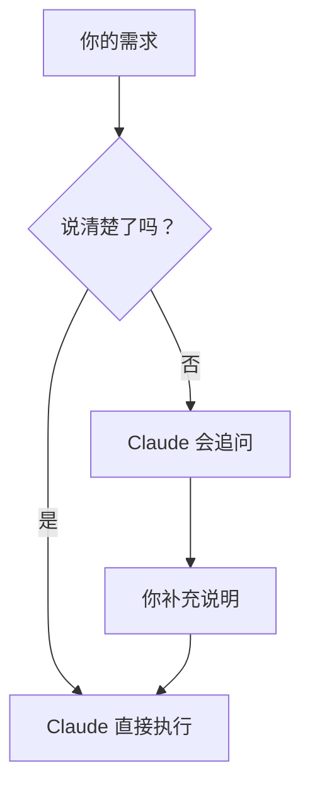
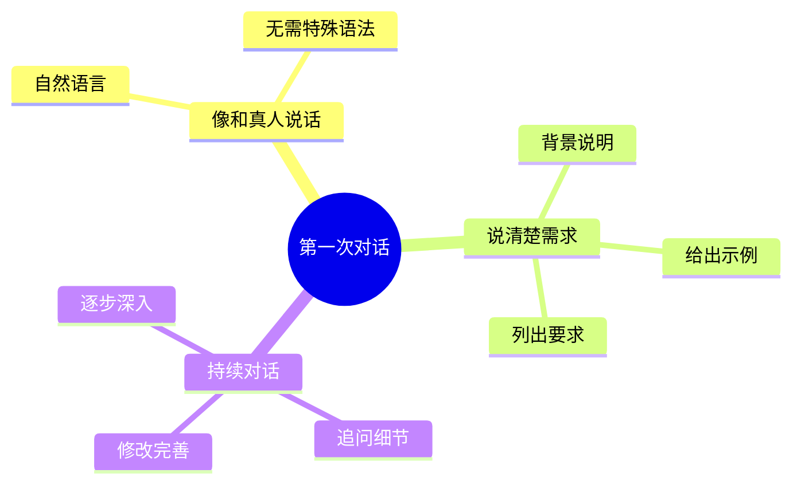

# 第一次对话：认识你的助理

> 🎯 本章目标：发送你的第一条消息，体验与 AI 助理对话的感觉

---

## 生活类比：和真人助理对话

想象你刚入职一家公司，公司给你配了一位助理。

第一天，你会怎么和 ta 打招呼？

```
你：「你好，我是新来的，以后请多关照」
助理：「你好！很高兴认识你，有什么需要随时找我」
```

**Claude Code 就是这样一位住在 VS Code 里的助理。**

你不需要学任何特殊语法，就像和真人说话一样，把你的需求说出来就行。

---

## 动手实践：发送第一条消息

### 第一步：打开 Claude Code

在 VS Code 中，你应该已经看到了 Claude Code 的界面。

```
┌─────────────────────────────────────┐
│  VS Code 窗口                        │
│  ┌─────────────────────────────────┐│
│  │                                 ││
│  │     Claude Code 对话区域         ││
│  │                                 ││
│  │  > 在这里输入你的消息...          ││
│  │                                 ││
│  └─────────────────────────────────┘│
└─────────────────────────────────────┘
```

### 第二步：发送第一条消息

在输入框中输入：

```
帮我想 5 个关于 AI 个人成长的选题
```

然后按 **Enter** 发送。

### 第三步：等待回复

Claude 会开始思考，然后给你回复。整个过程就像微信聊天一样自然。

---

## 实战案例：为文章选题

让我们用一个真实场景来练习。

假设你要写一篇公众号文章，主题是「AI 时代的个人成长」，但还没想好具体角度。

### 对话示例

**你输入：**
```
我是一个公众号作者，主要写 AI、个人成长、财富创富相关的内容。

现在想写一篇关于「AI 时代的个人成长」的文章，帮我想 5 个有吸引力的选题角度。

要求：
1. 标题要有吸引力，适合公众号传播
2. 每个选题附带一句话的核心观点
3. 考虑普通读者的认知水平
```

**Claude 可能的回复：**
```
好的，这里有 5 个选题角度供你参考：

1. 《AI 时代，最值钱的能力只有一个》
   核心观点：提问能力将取代答案记忆，成为核心竞争力

2. 《别人用 AI 写作，我用 AI 思考》
   核心观点：AI 不是替代思考，而是放大思考的工具

3. 《普通人的 AI 成长系统：每天 30 分钟的复利》
   核心观点：小步快跑，用 AI 加速每日微进步

4. 《为什么说 AI 时代更需要「慢思考」》
   核心观点：快速获取信息后，深度思考才是稀缺价值

5. 《AI 时代的个人护城河：你的独特性无法被训练》
   核心观点：AI 能模仿通用，但无法复制你的独特经历和视角
```

---

## 对话技巧：如何说清楚你的需求



### 三个提升对话效果的小技巧

| 技巧 | 说明 | 示例 |
|------|------|------|
| 🎯 说明背景 | 告诉 Claude 你是谁、在做什么 | 「我是公众号作者...」 |
| 📝 列出要求 | 用数字列表说明具体要求 | 「要求：1. 2. 3.」 |
| 🎨 给个例子 | 如果有参考，附上示例 | 「类似这种风格：...」 |

### 好问法 vs 差问法

```
❌ 差问法：
「帮我想个选题」

✅ 好问法：
「我是公众号作者，写 AI 相关内容。
 帮我想 5 个关于 AI 个人成长的选题。
 要求标题有吸引力，附带核心观点。」
```

**记住：你说得越清楚，Claude 给的答案越精准。**

这就像和真人助理沟通——你把需求说明白，ta 才能帮你做好。

---

## 继续对话：追问和修改

对话不是一次性的。你可以像和真人聊天一样，继续追问、修改、完善。

### 追问示例

```
你：这 5 个选题里，第 3 个「每天 30 分钟的复利」我比较感兴趣。
    能帮我展开一下这个选题的大纲吗？

Claude：好的，这是「普通人的 AI 成长系统」的文章大纲...
```

### 修改示例

```
你：大纲不错，但「复利」这个词太金融化了。
    能换个更生活化的表达吗？

Claude：明白，我把「复利」改成「滚雪球效应」...
```

---

## 本章小结



### 你学会了

1. ✅ 在 VS Code 中打开 Claude Code
2. ✅ 发送第一条消息
3. ✅ 用「背景 + 要求 + 示例」的方式说清需求
4. ✅ 通过追问和修改完善结果

### 下一步

在下一章，我们会学习如何让 Claude 记住你的写作风格，这样每次对话都不用重复说明背景了。

---

## 练习任务

试着完成这个对话：

```
场景：你要为公众号写一篇文章

任务：
1. 告诉 Claude 你的公众号定位
2. 请它帮你想 3 个选题
3. 选一个感兴趣的，让它展开大纲
4. 对大纲提出一个修改意见
```

完成后，你就真正入门了！🎉

---

*下一章：[02-记忆系统-让助理记住你的风格](./02-记忆系统-让助理记住你的风格.md)*
