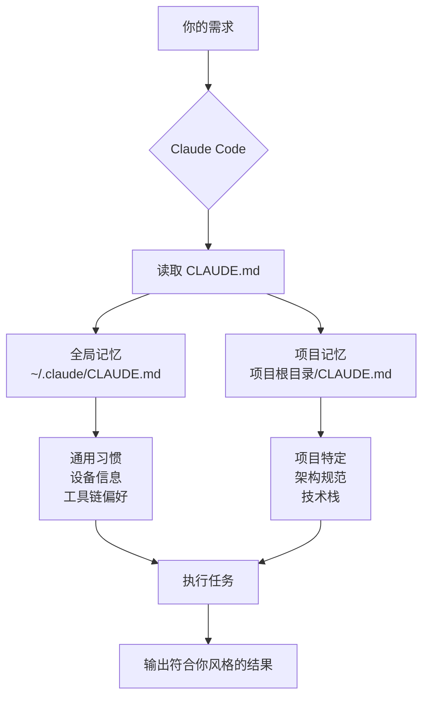
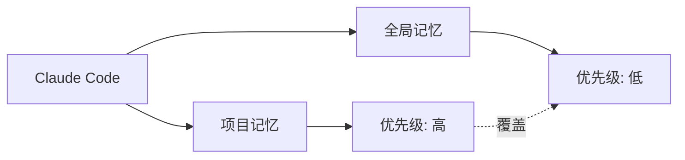

# 02-记忆系统：让助理记住你的风格

## 本章目标

学完这一章，你将会：

- 理解 Claude Code 的记忆系统工作原理
- 掌握 `/memory` 命令的使用方法
- 学会记录你的写作风格和工作偏好
- 了解记忆的层级结构（全局 vs 项目）

## 类比：助理的工作备忘录

想象一下，你新招了一个助理。刚开始合作时，你需要反复告诉 TA：

- "我习惯用金句开头"
- "我喜欢用案例支撑观点"
- "记得总结收尾"

但时间久了，如果助理能把这些习惯记在小本本上，下次就不用重复交代了。

**CLAUDE.md 就是这个小本本！**

它是 Claude Code 的「工作备忘录」，记录你的：
- 写作风格
- 技术栈偏好
- 工作流程习惯
- 交流方式

有了这个备忘录，每次对话 Claude 都会先看一眼，按照你的风格来干活。

## 记忆系统全景图



## 动手实践：/memory 命令

### 第一步：打开记忆编辑器

在 Claude Code 中输入：

```
/memory
```

你会看到两个选项：

| 选项 | 文件路径 | 作用范围 |
|------|---------|---------|
| **全局记忆** | `~/.claude/CLAUDE.md` | 所有项目都生效 |
| **项目记忆** | `当前项目/CLAUDE.md` | 只在当前项目生效 |

### 第二步：选择记忆层级

- **第一次使用**：建议选「全局记忆」，记录你的通用习惯
- **特定项目**：选「项目记忆」，记录项目架构和规范

### 第三步：编辑记忆内容

Claude Code 会自动打开编辑器，你可以用 Markdown 格式记录偏好。

## 案例：记录你的写作风格

假设你是公众号博主，风格是「金句开头、案例支撑、总结收尾」。

### 写入全局记忆

在 Claude Code 中输入：

```
/memory
```

选择「全局记忆」，在打开的文件中添加：

```markdown
# 我的写作风格

## 文章结构模板

1. **开头**：用金句或热点话题引入
   - 例如："流量红利消失的时代,内容为王不是口号,是生存法则"

2. **主体**：用真实案例支撑观点
   - 案例要有数据
   - 案例要有对比
   - 案例要接地气

3. **结尾**：总结收尾 + 行动指引
   - 例如："记住,好内容不是写出来的,是打磨出来的。现在就打开你的编辑器,试试今天的技巧吧！"

## 语言风格

- 多用短句,节奏快
- 口语化表达,不说大话
- 适当用emoji增强表达 (仅在文章中,代码里不用)
- 每段不超过 4 行

## 禁忌

- 不用专业术语堆砌
- 不写流水账
- 不用"众所周知"这种废话
```

### 验证记忆是否生效

保存后,和 Claude 说：

```
帮我写一篇公众号文章,主题是「如何提高写作效率」
```

Claude 会自动按照你记录的风格来写：
- 金句开头
- 案例支撑
- 总结收尾
- 短句、口语化

## 进阶：记忆的层级结构

### 两层记忆系统



### 优先级规则

| 层级 | 文件位置 | 生效范围 | 优先级 | 适合记录的内容 |
|------|---------|---------|-------|--------------|
| **全局记忆** | `~/.claude/CLAUDE.md` | 所有项目 | 低 | 通用习惯、设备信息、工具链 |
| **项目记忆** | `项目根目录/CLAUDE.md` | 当前项目 | 高 | 项目架构、技术栈、API规范 |

**冲突处理**：当两层记忆有冲突时，项目记忆优先。

### 实际案例

#### 全局记忆 (~/.claude/CLAUDE.md)

```markdown
# 全局开发偏好

- 编辑器: vim
- 包管理: pnpm
- 代码风格: 简洁、可读性优先
- 注释规范: TSDoc (前端) / JavaDoc (后端)
```

#### 项目记忆 (某个项目/CLAUDE.md)

```markdown
# 项目: 公众号后台管理系统

## 技术栈
- 前端: Next.js 14 + TypeScript + Tailwind CSS
- 后端: Spring Boot 3.2 + MySQL 8.0

## 架构规范
- API 统一使用 RESTful 风格
- 响应格式: `{ code, message, data }`
- 错误处理: 全局异常处理器

## 特殊约定
- 包管理: 本项目使用 npm (团队统一)  ← 覆盖全局的 pnpm
```

## 适合记录 vs 不适合记录

| 适合记录的内容 | 不适合记录的内容 |
|--------------|----------------|
| 写作风格偏好 | 具体文章内容 |
| 技术栈选择 (React vs Vue) | 临时需求 |
| 代码注释规范 | 密码、密钥 |
| 工作流程 (先调研再写代码) | 频繁变动的配置 |
| 交流风格 (直接、热情) | 一次性的指令 |
| 工具链偏好 (pnpm、vim) | 具体的代码实现 |
| 设备信息 (MacBook M1) | API 文档 (应该放项目文档) |
| 项目架构规范 | 个人隐私信息 |

### 记录原则

**DO 记录**：
- 重复性高的偏好
- 长期稳定的习惯
- 需要全局生效的规范

**DON'T 记录**：
- 一次性的需求
- 频繁变化的配置
- 敏感信息

## 常见问题

### Q1: 全局记忆和项目记忆应该记录什么?

**全局记忆**:
- 你的设备和开发环境 (MacBook M1、macOS)
- 通用工具链 (pnpm、vim、Docker)
- 交流风格 (热情、直接)
- 写作风格 (金句开头、案例支撑)

**项目记忆**:
- 项目技术栈 (Next.js 14、Spring Boot 3.2)
- 项目架构规范 (目录结构、命名规则)
- API 设计约定 (RESTful、响应格式)
- 部署流程 (Docker、Makefile)

### Q2: 记忆内容会被 Claude 学习吗?

不会。CLAUDE.md 只是每次对话时临时读取,不会永久改变 Claude 的模型。

就像助理的小本本,只在为你服务时看,不会影响 TA 为其他人服务。

### Q3: 记忆文件可以分享吗?

可以！特别是**项目记忆** (项目/CLAUDE.md),建议：
- 提交到 Git 仓库
- 团队成员共享
- 统一开发规范

**全局记忆**是个人的,不要提交到 Git。

### Q4: 记忆文件多大合适?

建议：
- **全局记忆**: 不超过 500 行
- **项目记忆**: 不超过 300 行

太长会影响 Claude 的处理速度,记录核心内容就好。

## 实战演练

### 任务：记录你的写作风格

1. 打开 Claude Code
2. 输入 `/memory`,选择「全局记忆」
3. 添加以下内容：

```markdown
# 我的写作风格

## 文章结构
- 开头: 金句或热点引入
- 主体: 真实案例 + 数据支撑
- 结尾: 总结 + 行动指引

## 语言风格
- 短句为主
- 口语化
- 适当用 emoji

## 禁忌
- 不用术语堆砌
- 不写流水账
```

4. 保存文件
5. 测试：`帮我写一篇关于「时间管理」的文章`

### 验收标准

Claude 生成的文章应该：
- 开头有金句
- 正文有案例
- 结尾有总结和行动指引
- 语言简洁、口语化

## 本章小结

### 核心概念

| 概念 | 作用 | 类比 |
|------|------|------|
| **CLAUDE.md** | 记录你的偏好和习惯 | 助理的工作备忘录 |
| **/memory 命令** | 编辑记忆文件 | 打开小本本 |
| **全局记忆** | 所有项目生效 | 通用工作手册 |
| **项目记忆** | 当前项目生效 | 项目说明书 |

### 关键要点

1. 记忆系统分两层：全局 + 项目
2. 项目记忆优先级高于全局记忆
3. 适合记录稳定、重复的偏好
4. 不要记录敏感信息和临时需求
5. 项目记忆可以提交 Git,全局记忆是个人的

### 下一步

现在你已经学会了让 Claude 记住你的风格,下一章我们将学习：

**「03-技能系统：给助理装上专业技能包」**

你会学到如何用 Skills 让 Claude 掌握：
- Docker 容器编排
- Makefile 自动化部署
- API 文档生成
- 测试用例编写

到时候,你的助理不仅记得你的习惯,还能掌握专业技能,真正成为你的超级助手！

---

**小提示**：现在就试试 `/memory` 命令,把你的写作风格记录下来吧！下次对话,Claude 就会自动按你的风格来写文章啦！
