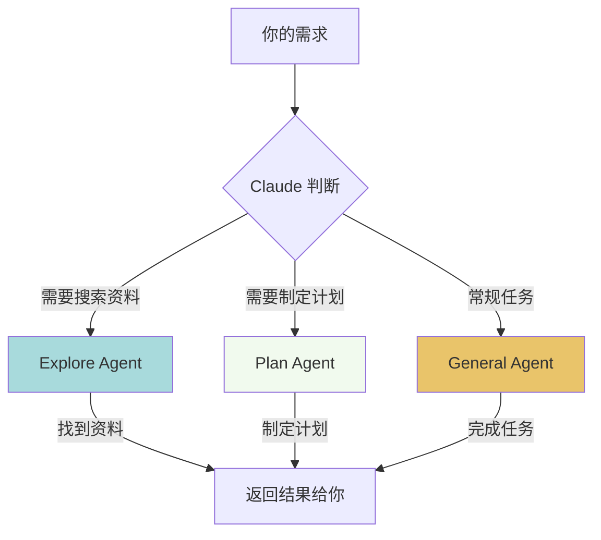
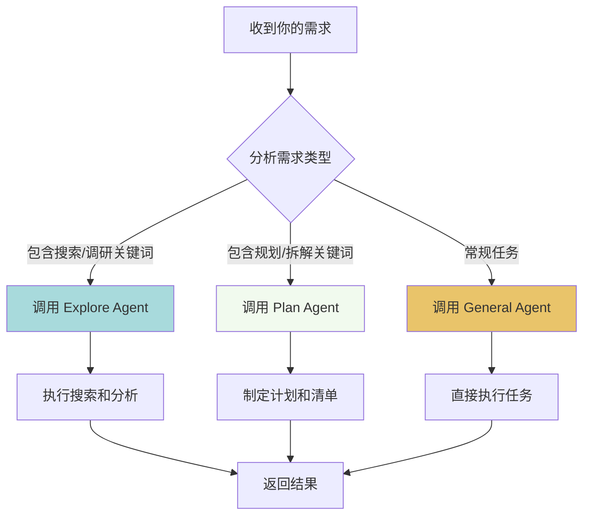
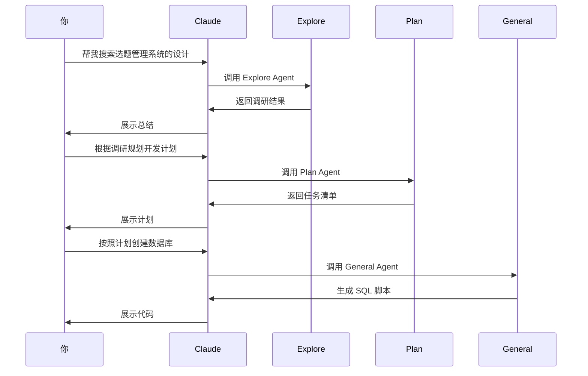

# 04 - 专业分身：认识不同的 Agent

## 本章目标

学完本章，你将能够：
- 理解什么是 Agent（代理）
- 认识三种内置 Agent 的特点和使用场景
- 知道如何让 Claude 自动选择合适的 Agent
- 掌握 `/agents` 命令查看和管理 Agent

## 一个生活化的类比：助理的「专业分身」

想象你是一家公司的老板，雇了一个超能干的助理——Claude。

但是呢，Claude 太忙了，所以他给自己「分身」出了几个专业版本：

- **资料搜索分身（Explore Agent）**：擅长快速翻阅资料、找信息，像一个超级图书管理员
- **规划大纲分身（Plan Agent）**：擅长做计划、拆解任务，像一个项目经理
- **全能分身（General Agent）**：什么都能干，但没有特别专精的领域

当你说「帮我找点资料」时，Claude 会自动派出「资料搜索分身」；
当你说「帮我规划一下这个项目」时，Claude 会自动派出「规划大纲分身」。

这就是 **Agent（代理）** 的核心概念：**针对不同任务，调用不同的专业分身来完成工作**。

## 三种内置 Agent 对比

Claude Code 内置了三种 Agent，它们各有所长：

| Agent 类型 | 擅长的工作 | 适用场景 | 特点 |
|-----------|----------|---------|------|
| **Explore Agent** | 快速搜索、调研、分析代码 | 「帮我找找关于心流理论的资料」 | 像图书管理员，善于翻阅、归纳 |
| **Plan Agent** | 拆解任务、制定计划、项目规划 | 「帮我规划一个公众号选题库系统」 | 像项目经理，善于分步骤、列清单 |
| **General Agent** | 通用任务、代码编写、文件操作 | 「帮我写个 README」 | 像全能助理，什么都能干 |

### 它们的协作关系（Mermaid 图）



Claude 会根据你的需求自动选择合适的 Agent，你不需要手动指定（当然你也可以手动指定）。

## Explore Agent：快速搜索资料的分身

### 特点

Explore Agent 是 Claude 的「资料搜索专家」，它擅长：

- 快速搜索代码文件
- 分析项目结构
- 调研技术方案
- 归纳总结信息

### 实践案例：搜索关于心流理论的资料

假设你的项目里有一些关于心流理论的文档，你想让 Claude 帮你找出来并总结：

#### 你的提问
```
帮我搜索项目中关于心流理论的资料，并总结一下核心观点
```

#### Explore Agent 的工作流程

1. **搜索阶段**：使用 Grep 工具搜索包含「心流」的文件
2. **阅读阶段**：读取相关文件内容
3. **分析阶段**：提取核心观点
4. **总结阶段**：归纳成结构化的总结

Claude 会自动调用 Explore Agent 来完成这个任务。

#### 你会看到类似这样的输出

```
正在搜索关于心流理论的资料...

找到以下文件：
- docs/心流理论笔记.md
- articles/心流与创作.md

核心观点总结：
1. 心流状态的三个特征：
   - 挑战与技能的平衡
   - 专注当下
   - 失去时间感

2. 进入心流的条件：
   - 明确的目标
   - 即时反馈
   - 适度的挑战
```

### 什么时候 Claude 会自动使用 Explore Agent？

当你的需求包含这些关键词时，Claude 很可能会调用 Explore Agent：

- 「帮我**找找**...」
- 「**搜索**一下...」
- 「**调研**一下...」
- 「**分析**一下项目结构」
- 「**看看**有没有...」

## Plan Agent：规划大纲的分身

### 特点

Plan Agent 是 Claude 的「项目经理」，它擅长：

- 拆解复杂任务
- 制定分步计划
- 评估工作量
- 列出待办清单（TodoWrite）

### 实践案例：规划一个公众号选题库系统

假设你想让 Claude 帮你规划一个公众号选题库系统：

#### 你的提问
```
帮我规划一个公众号选题库系统，需要支持标签分类和搜索功能
```

#### Plan Agent 的工作流程

1. **需求分析**：理解你的核心需求
2. **任务拆解**：把大任务拆成小任务
3. **制定计划**：列出执行步骤和优先级
4. **输出清单**：使用 TodoWrite 工具生成待办事项

#### 你会看到类似这样的输出

```
📋 任务规划：公众号选题库系统

[直接] 1. 确认技术栈
   - 前端：Next.js + TypeScript + Shadcn UI
   - 后端：Spring Boot 3.x + MySQL + Redis

[串行] 2. 数据库设计
   - 设计选题表（topics）
   - 设计标签表（tags）
   - 设计标签关联表（topic_tags）

[并发] 3. 以下任务可同时执行：
   - Task A: 实现后端 API（CRUD + 搜索）
   - Task B: 实现前端页面（列表 + 表单）
   - Task C: 实现标签管理功能

[串行] 4. 依赖上述结果：
   - 集成测试
   - 文档更新

总工作量：约 2-3 天
```

### 什么时候 Claude 会自动使用 Plan Agent？

当你的需求包含这些关键词时，Claude 很可能会调用 Plan Agent：

- 「帮我**规划**...」
- 「**制定计划**...」
- 「**拆解任务**...」
- 「**分步实施**...」
- 「**评估工作量**...」

## General Agent：全能分身

### 特点

General Agent 是 Claude 的「全能助理」，它擅长：

- 常规代码编写
- 文件读写操作
- 简单的问答
- 配置文件修改

### 适用场景

当你的需求比较简单、直接时，Claude 会使用 General Agent：

```
帮我写个 README
修改 package.json 的版本号
解释一下这段代码的作用
```

General Agent 是默认的 Agent，当 Claude 判断不需要特殊能力时，就会使用它。

## Claude 如何自动调度分身？

Claude 内部有一个「任务分发系统」，它会根据你的提问自动判断应该使用哪个 Agent：



### 关键规则

1. **自动识别**：Claude 会根据你的措辞自动选择合适的 Agent
2. **可以指定**：你也可以手动指定使用哪个 Agent（通过特殊语法）
3. **可以切换**：在一次对话中，Claude 可能会切换不同的 Agent

## /agents 命令：查看和管理 Agent

Claude Code 提供了 `/agents` 命令，让你可以查看当前可用的 Agent：

### 基本用法

在 Claude Code 中输入：

```
/agents
```

### 你会看到类似这样的输出

```
Available Agents:

1. Explore Agent
   - Description: 专注于代码搜索和项目调研
   - Status: Active

2. Plan Agent
   - Description: 专注于任务规划和拆解
   - Status: Active

3. General Agent
   - Description: 通用任务执行
   - Status: Active
```

### 其他相关命令

| 命令 | 作用 |
|-----|------|
| `/agents` | 查看所有可用 Agent |
| `/help` | 查看所有命令帮助 |

## 实战演练：让三种 Agent 协作

假设你想做一个「公众号选题库」系统，可以这样和 Claude 协作：

### Step 1：调研（Explore Agent）

```
帮我搜索一下现有的选题管理系统都是怎么设计的
```

Claude 会调用 Explore Agent，搜索相关资料并总结。

### Step 2：规划（Plan Agent）

```
根据调研结果，帮我规划一个公众号选题库系统的开发计划
```

Claude 会调用 Plan Agent，制定详细的分步计划。

### Step 3：执行（General Agent）

```
按照计划，先创建数据库表结构
```

Claude 会调用 General Agent，直接编写 SQL 脚本。

### 协作流程图



## 本章小结

### 核心概念

1. **Agent = 专业分身**：针对不同任务，Claude 会调用不同的专业分身
2. **三种内置 Agent**：Explore（搜索）、Plan（规划）、General（全能）
3. **自动调度**：Claude 会根据你的需求自动选择合适的 Agent
4. **可以协作**：一个复杂任务可能需要多个 Agent 协作完成

### 记忆口诀

- 找资料，用 **Explore**
- 做计划，用 **Plan**
- 写代码，用 **General**

### 下一章预告

下一章我们将学习：**如何用 Claude Code 管理你的第一个项目**

你将学会：
- 初始化项目
- 使用 Claude 生成代码
- 使用 Git 版本控制
- 部署到生产环境

敬请期待！

---

> 💡 **小贴士**：不用刻意记住哪个 Agent 干什么，Claude 会自动帮你选择。你只需要清晰地表达需求，剩下的交给 Claude！
