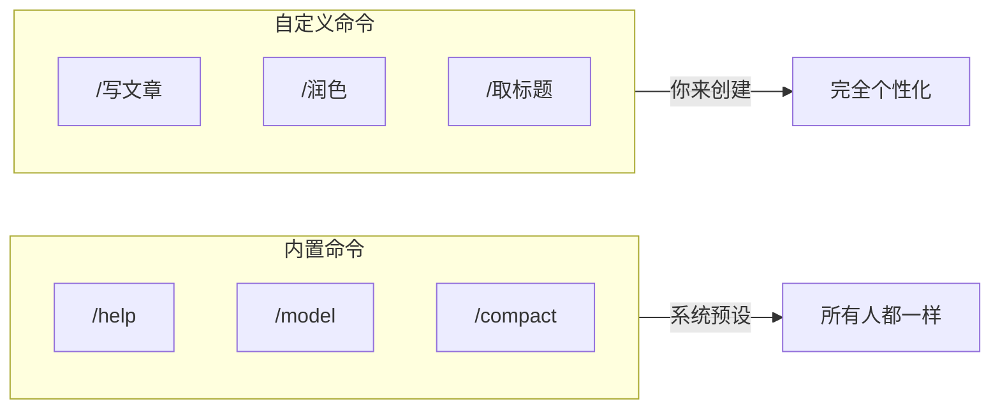
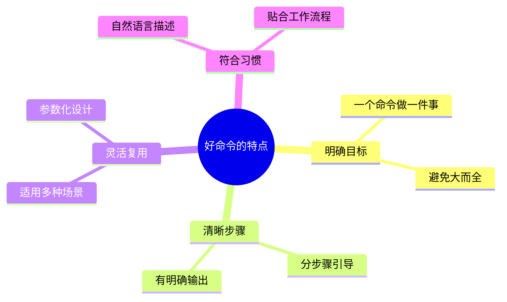

# 自定义命令：打造专属写作流程

> 🎯 本章目标：创建属于你自己的快捷命令，一键启动常用工作流程

---

## 生活类比：手机快捷指令

你用过 iPhone 的「快捷指令」吗？

```
┌─────────────────────────────────────┐
│  📱 iPhone 快捷指令                   │
├─────────────────────────────────────┤
│  「早安」指令：                        │
│  1. 关闭勿扰模式                       │
│  2. 播报今日天气                       │
│  3. 朗读日程安排                       │
│  4. 播放晨间音乐                       │
│                                      │
│  只需说「嘿 Siri，早安」               │
│  → 四个操作自动依次执行                 │
└─────────────────────────────────────┘
```

**Claude Code 的自定义命令，就是你的「AI 快捷指令」。**

把常用的工作流程写成一个命令，以后一键触发。

---

## 核心概念：什么是自定义命令

### 与内置命令的区别



| 对比项 | 内置命令 | 自定义命令 |
|--------|---------|-----------|
| 来源 | Claude Code 自带 | 你自己创建 |
| 数量 | 固定的 30+ 个 | 想建多少建多少 |
| 功能 | 通用功能 | 针对你的工作流 |
| 示例 | `/help` `/model` | `/写文章` `/润色` |

---

## 自定义命令的存放位置

```
你的项目文件夹/
└── .claude/
    └── commands/           ← 自定义命令放这里
        ├── 写文章.md        ← 一个文件 = 一个命令
        ├── 润色.md
        └── 取标题.md
```

**规则很简单：**
- 文件名 = 命令名（不含 .md）
- 文件内容 = 执行这个命令时，Claude 会收到的指令

---

## 动手实践：创建「写文章」命令

### 第一步：创建命令文件夹

如果还没有 `.claude/commands` 文件夹，先创建它：

```
你的项目/
└── .claude/
    └── commands/       ← 创建这个文件夹
```

### 第二步：创建命令文件

在 `commands` 文件夹中，创建文件 `写文章.md`：

```markdown
# 公众号文章写作助手

你现在是我的公众号写作助手。我要写一篇文章，请按以下流程帮我：

## 第一步：确认选题
请问我这篇文章想写什么主题？

## 第二步：拟定大纲
根据我的回答，给出文章大纲，包含：
- 标题（3 个备选）
- 开头（设计一个吸引人的开场）
- 正文结构（3-5 个核心段落）
- 结尾（行动号召或金句收尾）

## 第三步：逐段创作
大纲确认后，一段一段帮我写。每段写完等我确认再继续。

## 写作风格要求
- 口语化，像和朋友聊天
- 多用比喻和故事
- 段落简短，适合手机阅读
- 每个观点都要有案例支撑
```

### 第三步：使用命令

保存文件后，在 Claude Code 中输入：

```
/写文章
```

Claude 就会按照你设定的流程，开始引导你完成文章创作！

---

## 进阶示例：更多实用命令

### 命令 1：润色文章

文件：`.claude/commands/润色.md`

```markdown
# 文章润色助手

请帮我润色以下文章内容。

## 润色原则
1. 保持原意，优化表达
2. 让句子更简洁有力
3. 增加画面感和节奏感
4. 检查并修正错别字

## 输出格式
1. 先给出润色后的版本
2. 然后列出主要修改点
3. 最后给出 1-2 条改进建议

请等待我粘贴需要润色的内容。
```

使用方式：
```
/润色

（粘贴你的文章内容）
```

---

### 命令 2：取标题

文件：`.claude/commands/取标题.md`

```markdown
# 公众号标题生成器

请根据我提供的文章内容或主题，生成 10 个公众号标题。

## 标题风格
- 5 个「好奇型」：引发好奇心，让人想点进来看
- 3 个「价值型」：直接说明文章价值
- 2 个「情感型」：引发情感共鸣

## 标题要求
- 字数控制在 15-25 字
- 避免标题党，但要有吸引力
- 适合在朋友圈和公众号传播

## 输出格式
每个标题后面附上一句话，说明这个标题的设计思路。

请告诉我文章的主题或核心内容。
```

---

### 命令 3：写开头

文件：`.claude/commands/写开头.md`

```markdown
# 文章开头设计师

请帮我设计 3 个不同风格的文章开头。

## 开头风格选项
1. 「故事型」：用一个小故事引入主题
2. 「问题型」：抛出一个引人思考的问题
3. 「数据型」：用一个惊人的数据开场
4. 「场景型」：描绘一个读者熟悉的场景
5. 「金句型」：以一句有力的观点开头

## 输出要求
- 每个开头 100-150 字
- 要能自然引出文章主题
- 符合公众号阅读习惯

请告诉我文章的主题和目标读者。
```

---

## 命令参数：让命令更灵活

有时候你希望命令更灵活，可以接收参数。

### 使用 $ARGUMENTS 变量

文件：`.claude/commands/分析.md`

```markdown
# 内容分析助手

请分析以下内容：$ARGUMENTS

## 分析维度
1. 核心观点是什么
2. 论证逻辑是否清晰
3. 有哪些亮点
4. 有哪些可以改进的地方

## 输出格式
用表格形式呈现分析结果。
```

使用方式：
```
/分析 AI 正在改变我们的学习方式，从被动接收变成主动探索...
```

`$ARGUMENTS` 会被替换成你在命令后面输入的内容。

---

## 命令设计心法



### 设计命令的四个问题

1. **这个操作我经常做吗？** → 频繁的才值得做成命令
2. **每次做的流程差不多吗？** → 固定流程才能标准化
3. **需要 Claude 做什么？** → 明确 AI 的任务
4. **我希望得到什么输出？** → 定义期望结果

---

## 命令组织：建立你的写作工具箱

当命令多了，可以用文件夹分类：

```
.claude/commands/
├── 写作/
│   ├── 写文章.md
│   ├── 润色.md
│   ├── 取标题.md
│   └── 写开头.md
├── 分析/
│   ├── 分析文章.md
│   └── 拆解爆款.md
└── 日常/
    ├── 周报.md
    └── 复盘.md
```

使用时加上路径：
```
/写作/写文章
/分析/拆解爆款
```

---

## 实战：创建完整的写作流程命令

让我们创建一个串联整个写作流程的命令：

文件：`.claude/commands/完整写作.md`

```markdown
# 公众号文章完整创作流程

我们将一起完成一篇公众号文章的创作。整个过程分为 5 个阶段。

---

## 阶段一：选题确认

请告诉我：
1. 你想写什么主题？
2. 目标读者是谁？
3. 希望读者看完有什么收获？

我会根据你的回答，帮你明确选题方向。

---

## 阶段二：大纲设计

确认选题后，我会设计文章大纲：
- 3 个备选标题
- 文章结构（开头/正文/结尾）
- 每个部分的核心内容

请审核大纲，提出修改意见。

---

## 阶段三：内容创作

大纲确认后，我会逐段帮你写作：
- 每写完一段，等你确认
- 你可以随时要求修改
- 保持你的写作风格

---

## 阶段四：润色优化

初稿完成后，我会帮你：
- 优化文字表达
- 增强可读性
- 检查错别字
- 调整段落节奏

---

## 阶段五：最终检查

输出最终版本，包含：
- 完整文章
- 3 个备选标题
- 朋友圈转发语
- 文章摘要（用于公众号）

---

**准备好了吗？让我们开始吧！请告诉我你想写什么。**
```

---

## 本章小结

```
┌────────────────────────────────────────────────┐
│             自定义命令知识点                      │
├────────────────────────────────────────────────┤
│                                                │
│  📁 存放位置：.claude/commands/xxx.md           │
│                                                │
│  📝 命令规则：文件名 = 命令名                     │
│                                                │
│  🎯 使用方式：/命令名                            │
│                                                │
│  📦 参数传递：$ARGUMENTS                        │
│                                                │
│  📂 分类组织：用文件夹分类命令                    │
│                                                │
└────────────────────────────────────────────────┘
```

### 你学会了

1. ✅ 理解自定义命令的作用
2. ✅ 创建自己的写作命令
3. ✅ 使用参数让命令更灵活
4. ✅ 组织和管理多个命令

### 下一步

在下一章，我们会学习「Hooks 自动触发器」——让某些操作在特定时机自动执行。

---

## 练习任务

创建你的第一个自定义命令：

```
任务：
1. 在项目中创建 .claude/commands/ 文件夹
2. 创建一个 「润色.md」 命令文件
3. 写入润色指令（参考本章示例）
4. 在 Claude Code 中测试 /润色 命令
```

试试看，创建一个属于你的专属命令！🛠️

---

*上一章：[04-专业分身-认识不同的Agent](./04-专业分身-认识不同的Agent.md)*

*下一章：[06-自动触发器-Hooks系统入门](./06-自动触发器-Hooks系统入门.md)*
