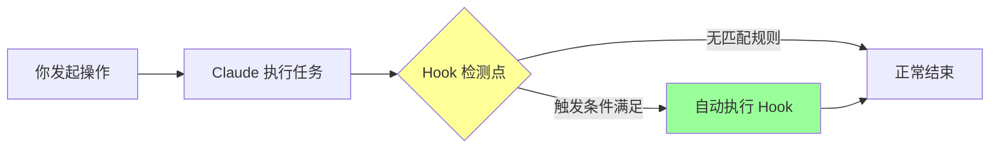
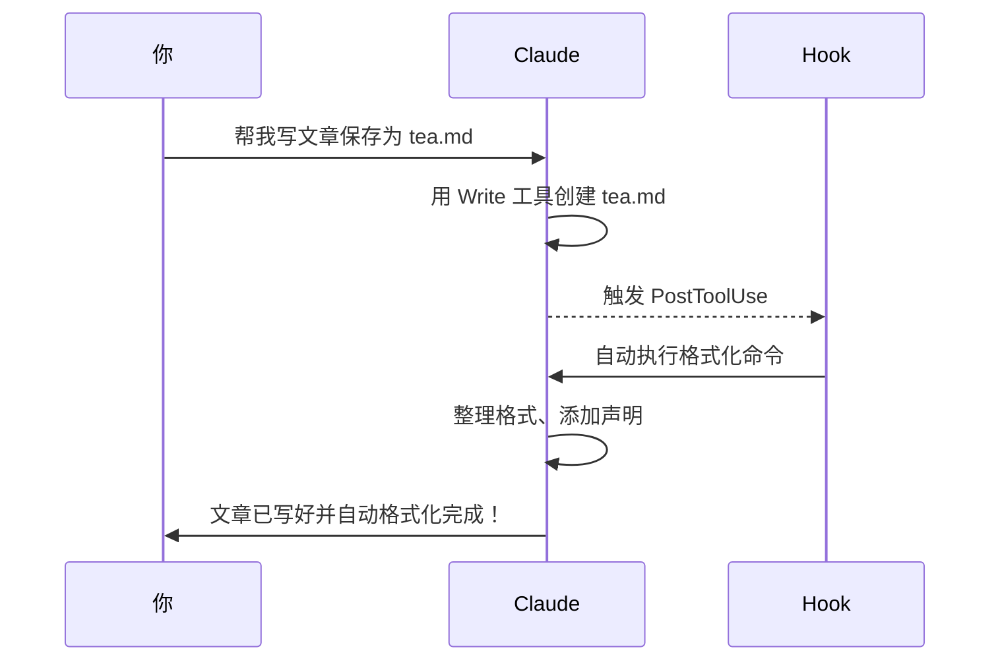

# 06-自动触发器：Hooks 系统入门

## 本章目标

学完本章你将掌握：

- 理解 Hooks 是什么（智能家居自动化类比）
- 知道常用的 Hook 触发时机
- 会配置第一个自动化规则
- 实现"写完文章自动整理格式"的实战案例

**学习时长**：15 分钟
**难度等级**：⭐⭐☆☆☆（需要一点点配置文件基础）

---

## 类比：智能家居的自动化场景

想象一下你家的智能家居系统：

| 触发条件 | 自动执行的动作 |
|---------|--------------|
| 门铃响了 | 自动开客厅灯 |
| 检测到你离家 | 自动关空调、锁门 |
| 晚上 8 点 | 自动拉上窗帘 |
| 检测到下雨 | 自动关窗户 |

这就是**自动化规则**的核心思想：**当某件事发生时，自动触发另一件事**。

Claude Code 的 Hooks 系统就是这样的"智能管家"：

```
当你完成某个操作（比如运行命令）
      ↓
自动触发预设的动作（比如整理文件格式）
```

---

## Hook 工作原理

用流程图看得更清楚：



### 举个例子

假设你配置了一个 Hook：

```
当 Claude 用完"写文件"工具后
  ↓
自动运行"检查错别字"命令
```

实际流程：

1. 你让 Claude 帮你写篇公众号文章
2. Claude 用 `Write` 工具创建了 `article.md`
3. **Hook 触发**：检测到"刚用完 Write 工具"
4. 自动执行：调用错别字检查工具扫描 `article.md`
5. 结果反馈给你

全程你只说了一句话，后面的检查完全自动化！

---

## 常用 Hook 事件（简化版）

Claude Code 提供了很多 Hook 触发点，这里只讲最常用的 3 个：

| Hook 类型 | 触发时机 | 典型应用场景 |
|----------|---------|-------------|
| **PostToolUse** | Claude 用完某个工具后 | 写完文件自动格式化、修改代码后自动测试 |
| **PreToolUse** | Claude 准备用某个工具前 | 修改文件前自动备份 |
| **PostUserMessage** | 你发送消息后 | 自动记录对话历史、自动保存聊天记录 |

### 重点：PostToolUse

这是最实用的 Hook，因为它能在 Claude **完成操作后**立即介入。

**核心参数**：

- `toolName`：指定监听哪个工具（比如 `Write`、`Edit`、`Bash`）
- `command`：触发后自动执行的命令

---

## 动手实践：配置第一个 Hook

### 步骤 1：找到配置文件

Hook 配置存放在：

```
~/.claude/settings.json
```

用文本编辑器打开它（如果没有就创建一个空文件）。

### 步骤 2：基础配置结构

一个标准的 `settings.json` 长这样：

```json
{
  "hooks": [
    {
      "type": "PostToolUse",
      "toolName": "Write",
      "command": "检查刚才写的文件是否有错别字"
    }
  ]
}
```

**配置说明**：

| 字段 | 作用 | 示例值 |
|-----|------|-------|
| `type` | Hook 类型 | `PostToolUse` |
| `toolName` | 监听的工具名 | `Write`（写文件工具） |
| `command` | 触发后执行的命令 | 你用自然语言写的指令 |

### 步骤 3：测试效果

保存配置后，试试让 Claude 写个文件：

```
帮我写一个 test.md 文件，内容是"今天天气真好"
```

如果配置生效，Claude 会：

1. 创建 `test.md`
2. 自动触发 Hook
3. 执行"检查错别字"命令

---

## 案例：写完文章自动整理格式

### 需求场景

你是公众号创作者，经常让 Claude 帮你写文章草稿。每次写完后你都要：

1. 检查标题是否有空格
2. 统一中英文标点符号
3. 添加文章末尾的版权声明

太麻烦了！用 Hook 自动化！

### 配置方案

编辑 `~/.claude/settings.json`：

```json
{
  "hooks": [
    {
      "type": "PostToolUse",
      "toolName": "Write",
      "command": "对刚才创建的 Markdown 文件执行格式化：1. 去除标题多余空格 2. 统一使用中文标点 3. 文末添加「本文由 AI 辅助创作」声明"
    }
  ]
}
```

### 实战测试

现在试试让 Claude 写文章：

```
帮我写一篇关于"冬天喝什么茶养生"的公众号文章，保存为 tea.md
```

**自动化流程**：



你只发了一条消息，后面的格式整理全自动完成！

---

## 进阶技巧：条件过滤

### 问题

上面的配置会对**所有 Write 操作**触发，但你可能只想对 `.md` 文件生效。

### 解决方案

使用 `filter` 参数：

```json
{
  "hooks": [
    {
      "type": "PostToolUse",
      "toolName": "Write",
      "filter": {
        "fileExtension": ".md"
      },
      "command": "格式化这个 Markdown 文件"
    }
  ]
}
```

这样只有创建 `.md` 文件时才触发 Hook。

---

## 常见问题与注意事项

### 1. Hook 不生效？

**检查清单**：

- [ ] `settings.json` 语法是否正确（JSON 格式很严格）
- [ ] 文件路径是否正确（`~/.claude/settings.json`）
- [ ] 重启 Claude Code 让配置生效

**调试技巧**：

用在线 JSON 校验工具检查语法：
```
https://jsonlint.com/
```

### 2. Hook 执行失败？

Hook 中的 `command` 就像你直接对 Claude 说话一样，要写得清楚：

❌ **不好的写法**：
```json
"command": "格式化"
```
（太模糊了，Claude 不知道格式化什么）

✅ **好的写法**：
```json
"command": "对刚才写的 Markdown 文件进行格式化，去除多余空格和统一标点符号"
```

### 3. Hook 会无限循环吗？

不会！Claude Code 有保护机制：

- Hook 触发的命令**不会再次触发 Hook**
- 避免了"写文件 → 触发 Hook → 又写文件 → 又触发 Hook"的死循环

---

## 更多实用案例

给你一些灵感：

| 场景 | Hook 配置 |
|-----|----------|
| 修改代码后自动测试 | `PostToolUse` + `Edit` → 执行 `npm test` |
| 创建文件后自动备份 | `PostToolUse` + `Write` → 复制到备份目录 |
| 提交代码前自动检查 | `PreToolUse` + `Bash` (git commit) → 运行 lint |
| 每次对话自动记录 | `PostUserMessage` → 追加到日志文件 |

---

## 本章小结

### 核心概念

- **Hook = 自动化触发器**，像智能家居一样"当...就..."
- **PostToolUse** 是最常用的 Hook，在工具执行后触发
- 配置文件在 `~/.claude/settings.json`

### 配置结构速记

```json
{
  "hooks": [
    {
      "type": "PostToolUse",           // 什么时候触发
      "toolName": "Write",             // 监听哪个工具
      "command": "你要执行的命令"        // 触发后做什么
    }
  ]
}
```

### 关键要点

1. Hook 让重复性操作自动化
2. `command` 要写清楚，就像直接和 Claude 对话
3. 可以用 `filter` 过滤触发条件
4. 不用担心死循环，系统有保护机制

---

## 下一章预告

学会了 Hook 这个"智能管家"，下一章我们来讲**如何用 Skills 给 Claude 装备"专业技能包"**——比如让它精通"公众号排版规范"或"小红书爆款标题写法"！

**关键词**：技能包、领域专家、知识库

---

**思考题**：你的工作中有哪些重复性操作可以用 Hook 自动化？评论区见！👇
